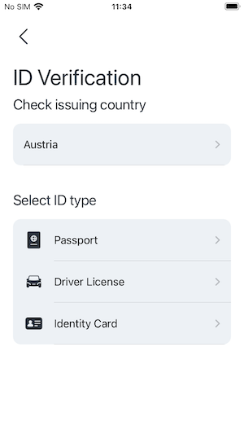
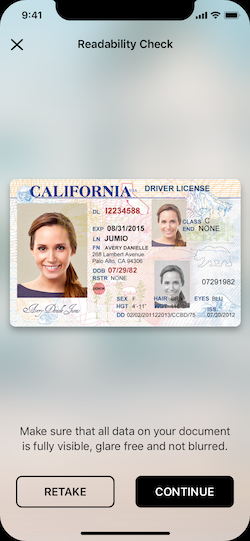

[](https://cocoapods.org/pods/JumioMobileSDK)
[](https://github.com/Carthage/Carthage)
[](https://swift.org/)

# Table of Contents
- [Overview](#overview)
- [Get Started](#get-started)
    - [ID Verification & Fastfill SDK](docs/integration_id-verification-fastfill.md)
    - [Authentication SDK](docs/integration_authentication.md)
    - [Document Verification SDK](docs/integration_document-verification.md)
    - [BAM Checkout SDK](docs/integration_bam-checkout.md)
- [Quickstart](#quickstart)
- [Basics](#basics)
    - [General Requirements](#general-requirements)
    - [Permissions](#permissions)
    - [Integration](#integration)
    - [App Thinning and Size Matters](#app-thinning-and-size-matters)
    - [Language Localization](#language-localization)
- [Security](#security)
- [Release Notes](#release-notes)
- [Support](#support)
- [Code Documentation](https://jumio.github.io/mobile-sdk-ios/Netverify/)
- [FAQ](docs/integration_faq.md)
- [Known Issues](docs/known_issues.md)

# Overview
The Jumio Software Development Kit (SDK) provides you with a set of tools and UIs (default or custom) to develop an iOS application perfectly fitted to your specific needs.

Onboard new users and easily verify their digital identities, by making sure the IDs provided by them are valid and authentic.  Extract data from IDs and credit cards completely automatically and within seconds. Confirm users really are who they say they are by having them take a quick selfie and match it to their respective documents. Jumio uses cutting-edge biometric technology such as 3D face mapping to make sure there is an actual, real-life person in front of the screen.

    

Using the Jumio SDK will allow you to create the best possible solution for your individual needs, providing you with a range of different services to choose from.

# Get Started
Please note that [basic setup](#basics) is required before continuing with the integration of any of the following services.

## Jumio ID Verification & Fastfill
ID Verification (formerly known as Netverify) is a secure and easy solution that allows you to establish the genuine identity of your users in your mobile application, by verifying their passports, government-issued IDs and VISA in real-time. Very user-friendly and highly customizable, it makes onboarding new customers quick and simple.

- [Integration ID Verification & Fastfill SDK](docs/integration_id-verification-fastfill.md)

## Jumio Authentication
Authentication is a cutting-edge biometric-based service that establishes digital identities of your users, simply by taking a selfie. Advanced 3D face mapping-technology quickly and securely authenticates users and their digital identities.

- [Integration Authentication SDK](docs/integration_authentication.md)

## Jumio Document Verification
Document Verification is a powerful solution that allows users to scan various types of documents quickly and easily in your mobile application. Data extraction is already supported for various document types, such as bank statements.

- [Integration Document Verification SDK](docs/integration_document-verification.md)

## Jumio BAM Checkout
BAM Checkout enables you to extract data from your customer's credit card and/or ID in your mobile application within seconds. Every checkout flow is fully automated, no manual input necessary!

- [Integration BAM Checkout SDK](docs/integration_bam-checkout.md)

# Quickstart
The aim of the following section is to provide quick and very basic guide on how to get started with the [iOS sample application](sample) that can be found here on Github. You will require a __commercial Jumio License__ to successfully run any of our examples. Please refer to sales@jumio.com for details.

First things first, you’ll need an up-to-date version of Xcode to open and work with the sample project.

Start by downloading the iOS sample application from the Jumio Github repo. You can do this either by cloning the repo (using SHH oder HTTPS) to your local device or simply downloading everything as a ZIP. Once you’ve got the sample application downloaded and unzipped if necessary, open Xcode. You’ll be faced with a couple of options. Choose __Open another project__ in the bottom right corner and navigate to where you’ve saved your sample application. Select the __JumioMobileSDKSample.xcodeproj__ and open it.

You also have the option of simply starting Xcode and choosing the option __Clone an existing project__ in the left-hand menu. In this case, you’ll need to add the URL of the [entire repository on Github](https://github.com/Jumio/mobile-sdk-ios). If prompted, choose __master__ and start cloning to your local device.

When the cloning is done, once again just choose the __JumioMobileSDKSample.xcodeproj__ and open it.

__Note:__ Our sample project on GitHub contains the sample implementation without our frameworks. The project file contains a “Run Script Phase” which downloads our frameworks automatically during build time.

The iOS sample application contains the packages `SampleObjc`and `SampleSwift`. Both of those packages contain the exact same thing, using Objective C and Swift respectively. In each of them, you will find:
`MainStoryboardSwift` / `MainStoryboardObjC`
`BAMCheckout`
`Netverify`
`Authentication`
`DocumentVerification`

Each of these folders contains at least one corresponding ViewController-class. In each class, the most important methods for this service is shown and quickly outlined.

At the top of each ViewController-class you’ll find the following parameters:

`config.apiToken`
`config.apiSecret`

If you haven’t done so yet, log into your Jumio customer portals. You can find your customer API token and API secret on the __Settings__ page under the __API credentials__ tab. Add your individual key and token instead of the placeholders.
The default setting for the data center is `JumioDataCenterUS`. If you're using [BAM Checkout](docs/integration_bam-checkout.md), you'll need to use the BAM API token and BAM API secret.

__Note:__ We strongly recommend storing all credentials outside of your app! We suggest to not hardcode them within your application but load them during runtime from your server-side implementation.

Once you start up the sample application, you'll be given the option of trying out ID Verification. Select a different service from the action bar at the bottom to try out another service. Your application will also need camera permission, which will be prompted for automatically once you try to start any of services.

### Tutorial List
* [Getting started (Video):](https://share.vidyard.com/watch/1EDj4nkj3ZsZRxWVHbrpDH) How to clone the repository and configure your Jumio credentials
* [Introduction (Video):](https://share.vidyard.com/watch/YHkdgbcXAZ1Leht9CH5Z7r) How to initialize the SDK, run the sample on your iOS device, and test the identity verification user journey
* [Configuring behavior (Video):](https://share.vidyard.com/watch/3UPJyHrbXnuyY91aNpKEKW) How to configure the behavior of the app using SDK parameters
* [Customizing appearance (Video):](https://share.vidyard.com/watch/3e7zjQ64gVpQ8Tw6KKQGMj) How to customize the look and feel of your application using the Jumio Surface tool

# Basics

## General Requirements
The minimum requirements for the SDK are:
- iOS 10.0 and higher
- Internet connection

The following architectures are supported in the SDK:
- ARMv7
- ARM64
- x86_64 works on iOS emulator only

## Permissions
The app’s Info.plist must contain the `NSCameraUsageDescription` key with a string value explaining to the user how the app uses this data. Example: *“This will allow <your-app-name> to take photos of your credentials."*

## Integration
Check the [Xcode sample project](sample) to learn the most common use. Make sure to use the device only frameworks for app submissions to the AppStore. Read more detailed information on this here: [Manual integration](/README.md#manually)

### Tutorial
[Integration into existing project (Video):](https://share.vidyard.com/watch/dd7sb8AZueTn89iZLpZLFp) How to add Jumio Mobile SDK-functionalities to an existing Xcode project

### Via Cocoapods
Jumio supports CocoaPods as dependency management tool for easy integration of the SDK.

If you are not yet using Cocoapods in your project, first run:
```
sudo gem install cocoapods
pod init
```
Then update your local clone of the specs repo in Terminal to ensure that you are using the latest podspec files using:
```
pod repo update
```
Adapt your Podfile and add the pod according to the product(s) you use. Check the following example how a Podfile could look like:
```
source 'https://github.com/CocoaPods/Specs.git'

use_frameworks! # Required for proper framework handling

pod 'JumioMobileSDK', '~>3.8.0' # Use Netverify, Authentication, Document Verification and BAM Checkout together in your app

pod 'JumioMobileSDK/Netverify', '~>3.8.0' # Use full Netverify and Authentication functionality
pod 'JumioMobileSDK/NetverifyBase', '~>3.8.0' # For Fastfill, Netverify basic functionality
pod 'JumioMobileSDK/NetverifyNFC', '~>3.8.0' # For Fastfill, Netverify functionality with NFC extraction
pod 'JumioMobileSDK/NetverifyBarcode', '~>3.8.0' # For Fastfill, Netverify functionality with barcode extraction
pod 'JumioMobileSDK/NetverifyFace+iProov', '~>3.8.0' # For Fastfill, Netverify functionality with identity verification, Authentication
pod 'JumioMobileSDK/NetverifyFace+Zoom', '~>3.8.0' # For Fastfill, Netverify functionality with identity verification, Authentication

pod 'JumioMobileSDK/DocumentVerification', '~>3.8.0' # Use Document Verification functionality

pod 'JumioMobileSDK/BAMCheckout', '~>3.8.0' # Use BAM Checkout functionality
```
#### iProov
iProov is distributed as an XCFramework, therefore **you are required to use Cocoapods 1.9.0 or newer**. If you are using iProov, you will also need to add the line to the target section of your podfile:
```
pod 'iProov'
```
Next, add the following lines to the bottom of your podfile:
```
post_install do |installer|
  installer.pods_project.targets.each do |target|
    if ['iProov', 'Socket.IO-Client-Swift', 'Starscream'].include? target.name
      target.build_configurations.each do |config|
          config.build_settings['BUILD_LIBRARY_FOR_DISTRIBUTION'] = 'YES'
      end
    end
  end
end
```
Install the pods to your project via Terminal:
```
pod install
```

#### Tutorial
[Integration with Cocoapods (Video):](https://share.vidyard.com/watch/otiA1BopzBJRjTqZr1JAck) How to add the Jumio Mobile SDK to an existing Xcode project using Cocoapods

### Via Carthage
Jumio supports Carthage as dependency management tool for easy integration of the SDK.

Adapt you Cartfile and add the JumioMobileSDK dependency. Check the following example how a Cartfile could look like:

```
binary "https://raw.githubusercontent.com/Jumio/mobile-sdk-ios/master/Carthage/JumioMobileSDK.json" == 3.8.0
```

Update you Carthage dependencies via Terminal:
```
carthage update
```

#### Tutorial
[Integration with Carthage (Video):](https://share.vidyard.com/watch/UykBvrRYpDwx2Rmuqpii3r) How to add the Jumio Mobile SDK to an existing Xcode project using Carthage


## App Thinning and Size Matters
App thinning (app slicing, bitcode and on-demand resources) is supported within the SDK. For app slicing, the image resources are placed within a xcassets collection. For ID Verification and Fastfill, some resource files (e.g. images) are loaded on demand.

In case you experience a build error when building your app in Debug configuration and aim to run it on a device, we advise to temporarily disable the build setting "Enable Bitcode" in your Xcode project.

### Manually

Download our frameworks manually via [ios-jumio-mobile-sdk-3.8.0.zip](https://mobile-sdk.jumio.com/com/jumio/ios/jumio-mobile-sdk/3.8.0/ios-jumio-mobile-sdk-3.8.0.zip).

__Note:__ Our sample project on GitHub contains the sample implementation without our frameworks. The project file contains a “Run Script Phase” which downloads our frameworks automatically during build time.

The Jumio Mobile SDK consists of several dynamic frameworks. Depending on which product you use, you'll have to add the right frameworks to your project.

Please see [Strip unused frameworks](docs/integration_faq.md#strip-unused-frameworks) for more information.

The framework binaries are available with support for device and simulator architecture. Make sure to remove the simulator architecture from our frameworks for app submissions to the AppStore. If this step is not performed, your submission will be rejected by Apple. Add the following code snippet as run script build phase to your app project and ensure that it is executed after the frameworks are embedded. Please see the required setup in our sample project.

__Note:__ The simulator architecture is automatically removed if using cocoapods via "[CP] Embed Pods Frameworks" build phase.
```shell
if [[ "$CONFIGURATION" == "Release" ]]; then
  $PROJECT_DIR/remove-simulator-architecture.sh
fi
```
Code snippet source: https://stackoverflow.com/questions/30547283/submit-to-app-store-issues-unsupported-architecture-x86

Add the following linker flags to your Xcode Build Settings:<br/>
__Note:__ Added automatically if using CocoaPods.
- "-lc++"
- "-ObjC" (recommended) or -all_load

Make sure that the following Xcode build settings in your app are set accordingly:

| Setting | Value |
| :--- | :---: |
| Link Frameworks Automatically | YES |

## Language Localization
Our SDK supports localization for different languages. All label texts and button titles can be changed and localized using the `Localizable-<YOUR_PRODUCT>.strings` file. Just adapt the values to your required language, add it to your app or framework project and mark it as Localizable. This way, when upgrading our SDK to a newer version your localization file won't be overwritten. Make sure, that the content of this localization file is up to date after an SDK update.
__Note:__ If using CocoaPods, the original file is located under `/Pods/JumioMobileSDK/Localizations`.

For our products ID Verification & Fastfill, Authentication & Document Verification we support following languages for your convenience:

_Afrikaans, Arabic, Bulgarian, Chinese(Simplified), Chinese(Traditional), Croatian, Czech, Danish, Dutch, Estonian, English, Finnish, French, German, Greek, Hindi, Hungarian, Indonesian, Italian, Japanese, Khmer, Korean, Latvian, Lithuanian, Maltese, Norwegian, Polish, Portuguese, Romanian, Russian, Slovak, Slovenian, Spanish, Swedish, Thai, Turkish, Vietnamese, Zulu_

Please check out our [sample project](sample) to see how to use the strings files in your app.

Our SDK supports accessibility features. Visually impaired users can enable __VoiceOver__ or increase __text size__ on their device. VoiceOver uses separate values in the localization file, which can be customised.

# Security
All SDK related traffic is sent over HTTPS using TLS and public key pinning, and additionally, the information itself within the transmission is also encrypted utilizing __Application Layer Encryption__ (ALE). ALE is Jumio custom-designed security protocol which utilizes RSA-OAEP and AES-256 to ensure that the data cannot be read or manipulated even if the traffic was captured.

# Release Notes
Please refer to our [Change Log](docs/changelog.md) for more information about our current SDK version and further details.

# Support

## Previous Version
The previous release version 3.7.2 of the Jumio Mobile SDK is supported until 2021-03-15.

In case the support period is expired, no bug fixes and technical support are provided anymore. Current bugs are typically fixed in the upcoming versions.
Older SDK versions will keep functioning with our server until further notice, but we highly recommend to always update to the latest version to benefit from SDK improvements and bug fixes.

## Two-factor Authentication
If you want to enable two-factor authentication for your Jumio customer portal [please contact us.](https://support.jumio.com) Once enabled, users will be guided through the setup upon their first login to obtain a security code using the "Google Authenticator" app.

## Licenses
The software contains third-party open source software. For more information, please see [licenses](licenses).

This software is based in part on the work of the Independent JPEG Group.

## Contact
If you have any questions regarding our implementation guide please contact Jumio Customer Service at support@jumio.com. The Jumio online helpdesk contains a wealth of information regarding our service including demo videos, product descriptions, FAQs and other things that may help to get you started with Jumio. [Check it out at here](https://support.jumio.com).

## Copyright
&copy; Jumio Corporation, 395 Page Mill Road, Suite 150, Palo Alto, CA 94306

The source code and software available on this website (“Software”) is provided by Jumio Corp. or its affiliated group companies (“Jumio”) "as is” and any express or implied warranties, including, but not limited to, the implied warranties of merchantability and fitness for a particular purpose are disclaimed. In no event shall Jumio be liable for any direct, indirect, incidental, special, exemplary, or consequential damages (including but not limited to procurement of substitute goods or services, loss of use, data, profits, or business interruption) however caused and on any theory of liability, whether in contract, strict liability, or tort (including negligence or otherwise) arising in any way out of the use of this Software, even if advised of the possibility of such damage.
In any case, your use of this Software is subject to the terms and conditions that apply to your contractual relationship with Jumio. As regards Jumio’s privacy practices, please see our privacy notice available here: [Privacy Policy](https://www.jumio.com/legal-information/privacy-policy/).
