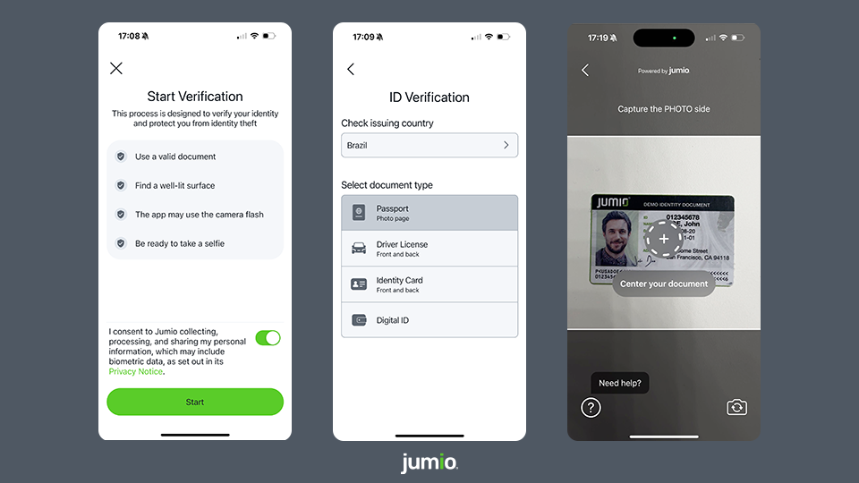
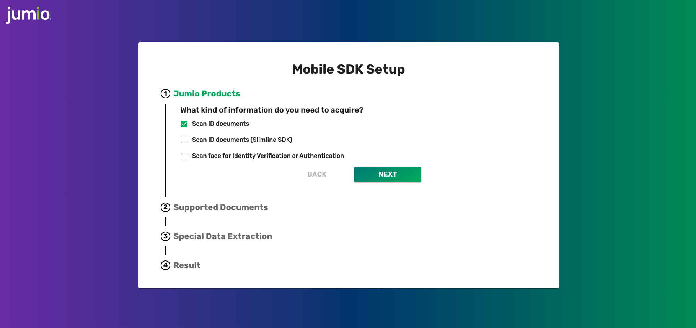

[](https://jumio.github.io/mobile-sdk-ios/Jumio)


[](https://cocoapods.org/pods/Jumio)
[](https://github.com/Carthage/Carthage)
[](https://img.shields.io/badge/Swift_Package_Manager-compatible-orange?style=flat-square)
[](https://swift.org/)

# Table of Contents
- [Overview](#overview)
- [Get Started](#get-started)
  - [Jumio SDK Integration](#jumio-sdk-integration)
  - [Code Documentation](#code-documentation)
  - [FAQ](#faq)
  - [Known Issues](#known-issues)
- [Quickstart](#quickstart)
- [Basics](#basics)
  - [General Requirements](#general-requirements)
  - [Authentication and Encryption](#authentication-and-encryption)
  - [Permissions](#permissions)
  - [Integration](#integration)
  - [App Thinning and Size Matters](#app-thinning-and-size-matters)
  - [Language Localization](#language-localization)
- [ML Models](#ml-models)
- [Document Verification](#document-verification)
- [Digital Identity](#digital-identity)
- [Analytics with Datadog](#analytics-with-datadog)
- [Security](#security)
- [Release Notes](#release-notes)
- [Maintenance and Support](#maintenance-and-support)
  - [Two-factor Authentication](#two-factor-authentication)
  - [Licenses](#licenses)
  - [Contact](#contact)
  - [Copyright](#copyright)

# Overview
The Jumio Software Development Kit (SDK) provides you with a set of tools and UIs (default or custom) to develop an iOS application perfectly fitted to your specific needs.

Onboard new users and easily verify their digital identities, by making sure the IDs provided by them are valid and authentic. Extract data from ID documents completely automatically and within seconds. Confirm users really are who they say they are by having them take a quick selfie and match it to their respective documents. Jumio uses cutting-edge biometric technology to make sure there is an actual, real-life person in front of the screen.



Using the Jumio SDK will allow you to create the best possible solution for your individual needs, providing you with a range of different services to choose from.

-----

# Get Started
Please note that [basic setup](#basics) is required before continuing with the integration of any of the following services.

## Jumio SDK Integration
Jumio KYX platform and related services are a secure and easy solution that allows you to establish the genuine identity of your users in your mobile application, by verifying their passports, government-issued IDs and actual liveness in real-time. Very user-friendly and highly customizable, it makes onboarding new customers quick and simple.

:arrow_right:&nbsp;&nbsp;[SDK INTEGRATION GUIDE](docs/integration_guide.md)    
:arrow_right:&nbsp;&nbsp;[Changelog](docs/changelog.md)    
:arrow_right:&nbsp;&nbsp;[Transition Guide](docs/transition_guide.md)    

#### Previous SDK Versions
If you need information on older SDK versions, please refer to:    
- [3.9.4](https://github.com/Jumio/mobile-sdk-ios/tree/v3.9.4)
- [3.9.3](https://github.com/Jumio/mobile-sdk-ios/tree/v3.9.3)
- [3.9.2](https://github.com/Jumio/mobile-sdk-ios/tree/v3.9.2)
- [3.9.1](https://github.com/Jumio/mobile-sdk-ios/tree/v3.9.1)
- [3.9.0](https://github.com/Jumio/mobile-sdk-ios/tree/v3.9.0)

## Code Documentation
Full API documentation for the Jumio iOS SDK can be found [here](https://jumio.github.io/mobile-sdk-ios/Jumio).

## FAQ
Link to Jumio iOS SDK FAQ can be found [here](docs/integration_faq.md).

## Known Issues
List of known issues can be found [here](docs/known_issues.md).

-----

# Quickstart
 This section provides a quick overview on how to get started with the [iOS sample application](sample) that can be found here on Github. You will require a __commercial Jumio License__ to successfully run any of our examples; for details, contact sales@jumio.com. You will also need a current Xcode version to open and try out the sample project.

Start by downloading the iOS sample application from the Jumio Github repo. You can do this either by cloning the repo (using SHH oder HTTPS) to your local device or simply downloading everything as a ZIP. Once you’ve got the sample application downloaded and unzipped if necessary, open Xcode. You’ll be faced with a couple of options. Choose __Open another project__ in the bottom right corner and navigate to where you’ve saved your sample application. Select the __SampleApp.xcodeproj__ and open it.

You also have the option of simply starting Xcode and choosing the option __Clone an existing project__ in the left-hand menu. In this case, you’ll need to add the URL of the [entire repository on Github](https://github.com/Jumio/mobile-sdk-ios). If prompted, choose __master__ and start cloning to your local device.

When the cloning is done, once again just choose the __SampleApp.xcodeproj__ and open it.

__Note:__ Our sample project on GitHub contains the sample implementation without our frameworks. The project contains a pre-action run script `jumio-sdk-checkout.sh`, which downloads our frameworks automatically during build time.

The iOS sample application contains two packages `CustomUI` and `DefaultUI`, as well as Delegates and the classes `ViewController.swift` and `ResultViewController.swift`. Use the ViewController class to either start CustomUI or DefaultUI by using a valid SDK token and data center.

If you haven't done so already, please refer to the [Authentication and Encryption section](#authentication-and-encryption) for more details on how to obtain your SDK token. Add your individual SDK token instead of the placeholder `""`. The default setting for the data center is `JumioDataCenter.US`.

⚠️&nbsp;&nbsp;__Note:__ We strongly recommend not storing any credentials inside your app! We suggest loading them during runtime from your server-side implementation.

In the `DefaultUI` package, you will find the class `DefaultUI.swift`. In the `CustomUI` package you will find:
* `ViewController` containing several ViewController classes
* `Handling` containing `ControllerHandling.swift`, `CredentialHandling.swift` and `ScanPartHandling.swift`
* `CustomUINavigationController.swift`

In each class, the most important methods for this service is shown and quickly outlined.

Once you start up the sample application, you'll be given the option of trying out the Jumio SDK. Select a service from the action bar at the bottom to try out different services. Your application will also need camera permission, which will be prompted for automatically once you try to start any of services.

⚠️&nbsp;&nbsp;__Note:__ We only support the Jumio SDK on physical devices. The app will compile on simulator, but you won't be able to run the SDK.

-----

# Basics

## General Requirements
The minimum requirements for the SDK are:
- iOS 12.0 and higher
- Internet connection
- Jumio KYX or Jumio API v3

The following architectures are supported in the SDK:
- device: arm64
- simulator: arm64 x86_64

## Authentication and Encryption
ℹ️&nbsp;&nbsp;__As of version 4.0.0 and onward, the SDK can only be used in combination with Jumio KYX or Jumio API v3. API v2 as well as using API token and secret to authenticate against the SDK will no longer be compatible.__

Before starting a session in our SDK, an SDK token has to be obtained. Refer to out [API Guide](https://docs.jumio.com/production/Content/Integration/Integration%20Guide.htm) for further details. To authenticate against the API calls, an OAuth2 access token needs to be retrieved from the Customer Portal.

Within the response of the [Account Creation or Account Update](https://docs.jumio.com/production/Content/Integration/Creating%20or%20Updatng%20Account/Creating%20or%20Updating%20Accounts.htm) API, an SDK token is returned, which needs to be applied to initiate the mobile SDK.

### Authentication with OAuth2
Your OAuth2 credentials are constructed using your API token as the Client ID and your API secret as the Client secret. You can view and manage your API token and secret in the Customer Portal under:
* __Settings > API credentials > OAuth2 Clients__

Client ID and Client secret are used to generate an OAuth2 access token. OAuth2 has to be activated for your account. Contact your Jumio Account Manager for activation.

#### Access Token URL (OAuth2)
* US: `https://auth.amer-1.jumio.ai/oauth2/token`
* EU: `https://auth.emea-1.jumio.ai/oauth2/token`
* SG: `https://auth.apac-1.jumio.ai/oauth2/token`

The [TLS Protocol](https://tools.ietf.org/html/rfc5246) is required to securely transmit your data, and we strongly recommend using the latest version. For information on cipher suites supported by Jumio during the TLS handshake see [supported cipher suites](https://docs.jumio.com/production/Content/Integration/API%20Authorization/Supported%20Cipher%20Suites.htm?Highlight=cipher).

ℹ️&nbsp;&nbsp; Calls with missing, incorrect or suspicious headers or parameter values will result in HTTP status code __400 Bad Request Error__ or __403 Forbidden__

#### Request Access Token (OAuth2)
```
curl --request POST --location 'https://auth.amer-1.jumio.ai/oauth2/token' \
    --header 'Accept: application/json' \
    --header 'Content-Type: application/x-www-form-urlencoded' \
    --data-raw 'grant_type=client_credentials' \
    --basic --user CLIENT_ID:CLIENT_SECRET
```

#### Response Access Token (OAuth2)
```
{
  "access_token": "YOUR_ACCESS_TOKEN",
  "expires_in": 3600,
  "token_type": "Bearer"
}
```

#### Access Token Timeout (OAuth2)
Your OAuth2 access token is valid for 60 minutes. After the token lifetime is expired, it is necessary to generate a new access token.

### Workflow Transaction Token Timeout
The token lifetime is set to 30 minutes per default. It can be configured via the [Jumio Customer Portal](https://docs.jumio.com/production/Content/Settings/Identity%20Verification/Application%20Settings.htm) and can be overwritten using the API call (`tokenLifetime`). Within this token lifetime the token can be used to initialize the SDK.

As soon as the workflow (transaction) starts, a 15 minutes session timeout is triggered. For each action performed (capture image, upload image) the session timeout will reset, and the 15 minutes will start again.

After creating/updating a new account you will receive a `sdk.token` (JWT) for initializing the SDK. Use this SDK token with your iOS code:
```
sdk = Jumio.SDK()
sdk.token = "YOUR_SDK_TOKEN"
sdk.dataCenter = jumioDataCenter
```

## Permissions
The app’s Info.plist must contain the `NSCameraUsageDescription` key with a string value explaining to the user how the app uses this data. Example: *“This will allow <your-app-name> to take photos of your credentials."*

## Integration
The [SDK Setup Tool](https://jumio.github.io/mobile-configuration-tool/out/) is a web tool that helps determine available product combinations and corresponding dependencies for the Jumio SDK, as well as an export feature to easily import the applied changes straight into your codebase.

[](https://jumio.github.io/mobile-configuration-tool/out/)

Additionally, check out the [Xcode sample project](sample) to learn the most common use. Make sure to use the device only-frameworks for app submissions to the AppStore. Read more detailed information on this here: [Manual integration](docs/integration_guide.md#manually)

## App Thinning and Size Matters
App thinning (app slicing, bitcode and on-demand resources) is supported within the SDK. For app slicing, the image resources are placed within a xcassets collection. For ID Verification, some resource files (e.g. images) are loaded on demand.

## Language Localization
Our SDK supports localization for different languages. All label texts and button titles can be changed and localized using the `Localizable-Jumio.strings` file. Just adapt the values to your required language, add it to your app or framework project and mark it as Localizable. This way, when upgrading our SDK to a newer version your localization file won't be overwritten. Make sure, that the content of this localization file is up to date after an SDK update.

ℹ️&nbsp;&nbsp;__Note:__ If using CocoaPods, the original file is located under `/Pods/Jumio/Localizations`.

ℹ️&nbsp;&nbsp;__Note:__ If using Swift Package Manager, make sure to add your supported languages in the Info.plist under the CFBundleLocalizations key.

Jumio SDK products support following languages for your convenience:

_Afrikaans, Arabic, Bulgarian, Chinese (Simplified), Chinese (Traditional), Croatian, Czech, Danish, Dutch, Estonian, English, Finnish, French, German, Greek, Hindi, Hungarian, Indonesian, Italian, Japanese, Khmer, Korean, Latvian, Lithuanian, Maltese, Norwegian, Polish, Portuguese (Portugal), Portuguese (Brazil), Romanian, Russian, Serbian (Cyril), Serbian (Latin), Slovak, Slovenian, Spanish, Swedish, Thai, Turkish, Ukrainian, Vietnamese, Zulu_

Please check out our [sample project](sample) to see how to use the strings files in your app.

Our SDK supports accessibility features. Visually impaired users can enable __VoiceOver__ or increase __text size__ on their device. VoiceOver uses separate values in the localization file, which can be customized.

----

# ML Models
The Jumio SDK utilizes ML Models to enable client-/server-side verification.

Required models can be provided by downloading and adding them manually to the bundle or preloading them. The SDK will load them on demand if none of the previous is applied.

Loading the models in advance will improve startup time of the SDK.

For more details, please refer to our [integration guide](docs/integration_guide.md#ml-models).

----

# Document Verification
As of iOS SDK 4.3.0, Document Verification functionality is available.
This functionality allows users to submit a number of different document types (e.g. a utility bill or bank statement) in digital form and verify the validity and authenticity of this document.

Documents can be submitted using one of two ways: Taking a photo of the document or uploading a PDF file.
For more details, please refer to our [integration guide](docs/integration_guide.md#jumio-document-credential).

### Supported Documents:
* BC (Birth certificate)
* BS (Bank statement)
* CAAP (Cash advance application)
* CB (Council bill)
* CC (Credit card)
* CCS (Credit card statement)
* CRC (Corporate resolution certificate)
* CUSTOM (Custom document type)
* HCC (Health care card)
* IC (Insurance card)
* LAG (Lease agreement)
* LOAP (Loan application)
* MEDC (Medicare card)
* MOAP (Mortgage application)
* PB (Phone bill)
* SEL (School enrollment letter)
* SENC (Seniors card)
* SS (Superannuation statement)
* SSC (Social security card)
* STUC (Student card)
* TAC (Trade association card)
* TR (Tax return)
* UB (Utility bill)
* VC (Voided check)
* VT (Vehicle title)
* WWCC (Working with children check)

ℹ️&nbsp;&nbsp;__Note:__ To enable the use of this feature, please contact [Jumio support](#support).

----

# Digital Identity
As of Jumio iOS SDK 4.5.0, users may use their Digital Identity to verify their identity.
For now 'Brazil CNH-e PDF' and 'ID by Mastercard' are the only Digital Identity providers currently supported by our SDK.

If you want to enable Digital Identity verification for your account please [contact us](https://support.jumio.com).
In case you are already set up to use Digital Identity verificaiton within your app, check out the integration steps explained [here](docs/integration_guide.md#digital-identity).

----

# Analytics With Datadog
Analytic feedback and diagnostics enable us to continually improve our SDK and its performance, as well as investigate potential issues. With the Jumio SDK, we use [Datadog](https://github.com/DataDog/dd-sdk-ios) as an optional tool to collect diagnostic information. Data collected includes specific SDK information like version numbers, started and finished SDK instances and scan workflows, thrown exceptions and error information, as well as other mobile events. Please note that gathering analytics data requires user consent due to legal regulations such as GDPR. The consent is granted when our MLA is accepted.

To benefit from Datadog, include the `JumioDatadog` in your project (for more details, see [Dependencies](docs/integration_guide.md#dependencies):

----

# Security
All SDK related traffic is sent over HTTPS using TLS and public key pinning, and additionally, the information itself within the transmission is also encrypted utilizing __Application Layer Encryption__ (ALE). ALE is Jumio custom-designed security protocol which utilizes RSA-OAEP and AES-256 to ensure that the data cannot be read or manipulated even if the traffic was captured.

----

# Release Notes
Please refer to our [Change Log](docs/changelog.md) for more information about our current SDK version and further details.

# Maintenance and Support
Please refer to our [SDK maintenance and support policy](docs/maintenance_policy.md) for more information about Mobile SDK maintenance and support.

## Two-factor Authentication
If you want to enable two-factor authentication for your Jumio Customer Portal [please contact us.](https://support.jumio.com). Once enabled, users will be guided through the setup upon their first login to obtain a security code using the "Google Authenticator" app.

## Licenses
The source code and software available on this website (“Software”) is provided by Jumio Corporation or its affiliated group companies (“Jumio”) “as is” and any express or implied warranties, including, but not limited to, the implied warranties of merchantability and fitness for a particular purpose are disclaimed. In no event shall Jumio be liable for any direct, indirect, incidental, special, exemplary, or consequential damages (including but not limited to procurement of substitute goods or services, loss of use, data, profits, or business interruption) however caused and on any theory of liability, whether in contract, strict liability, or tort (including negligence or otherwise) arising in any way out of the use of this Software, even if advised of the possibility of such damage. 

In any case, your use of this Software is subject to the terms and conditions that apply to your contractual relationship with Jumio. As regards Jumio’s privacy practices, please see our privacy notice available here: [Privacy Policy](https://www.jumio.com/privacy-center/privacy-notices/online-services-notice/).

The software contains third-party open source software. For more information, please see [licenses](licenses).

This software is based in part on the work of the Independent JPEG Group.

## Contact
If you have any questions regarding our implementation guide please contact Jumio Customer Service at support@jumio.com. The Jumio online helpdesk contains a wealth of information regarding our service including demo videos, product descriptions, FAQs and other things that may help to get you started with Jumio. [Check it out at here](https://support.jumio.com).

## Copyright
&copy; Jumio Corporation, 100 Mathilda Place Suite 100 Sunnyvale, CA 94086
