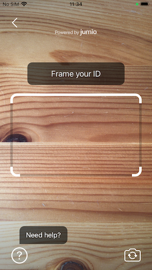
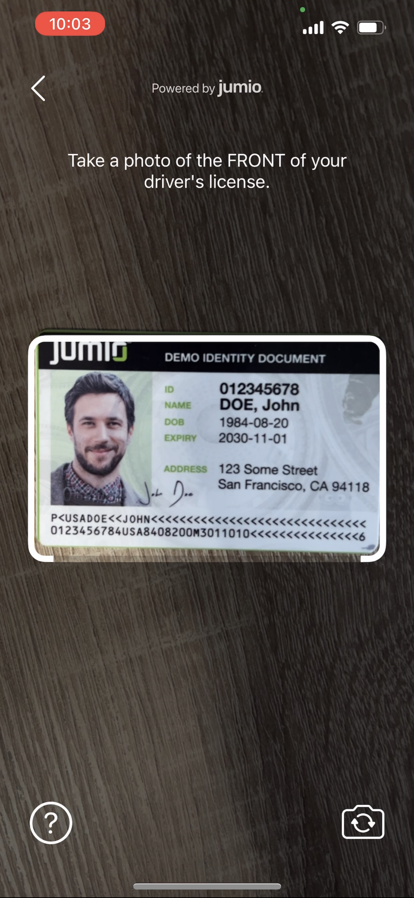
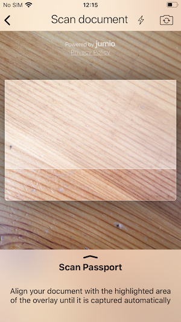
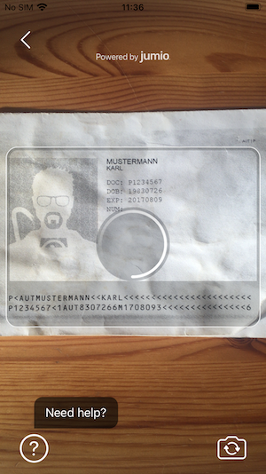
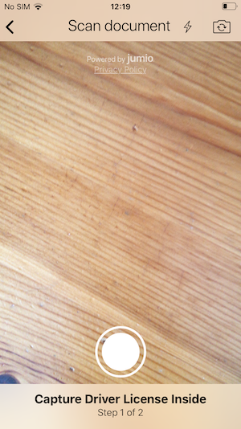
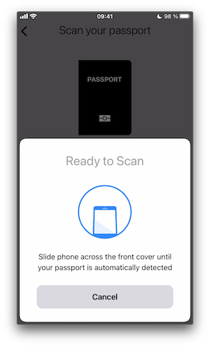
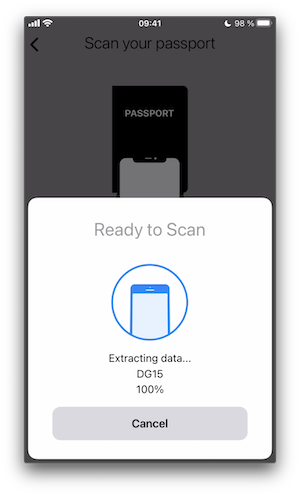
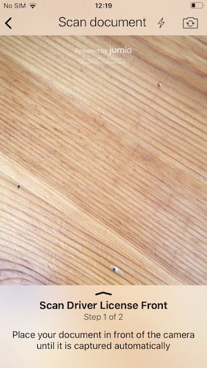
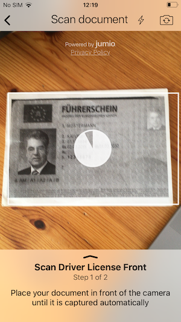

# FAQ

## Table of Contents
- [Improving User Experience and Reduce Drop-off Rate](#improve-user-experience-and-reduce-drop-off-rate)
- [Managing Errors](#managing-errors)
- [Reducing the Size of Your App](#reducing-the-size-of-your-app)
	- [Strip Unused Frameworks](#strip-unused-frameworks)
	- [Bitcode](#bitcode)
- [Jumio Authentication Workflow Integration](#jumio-authentication-workflow-integration)
- [Language Localization](#language-localization)
	- [iProov String Keys](#iproov-string-keys)
- [Glossary of Commonly Used Abbreviations ](#glossary)
- [Jumio Support](#jumio-support)

## Improve User Experience and Reduce Drop-off Rate
When evaluating user flows, one of the most commonly used metrics is the rate of drop-offs. At Jumio, we see considerable variance in drop-off rates across industries and customer implementations. For some implementations and industries, we see a higher rate of drop-offs on the first screens when compared with the average.
Scanning an ID with sensitive personal data printed on it naturally creates a high barrier for participation on the part of the end user. Therefore, conversion rates can be significantly influenced when the application establishes a sense of trust and ensures that users feel secure sharing their information.

One pattern that is recognizable throughout all of our customers’ SDK implementations: the more seamless the SDK integration, and the better job is done of setting user expectations prior to the SDK journey, the lower the drop-off rate becomes.

Our SDK provides a variety of [customization options](integration_id-verification-fastfill.md#customization) to help customers achieve a seamless integration. For customers using the standard SDK workflow, our [Surface tool](https://jumio.github.io/surface-ios/) provides an easy-to-use WYSIWYG interface to see simple customization options that can be incorporated with minimal effort and generate the code necessary to implement them. For customers who want to have more granular control over look and feel, our SDK offers the [CustomUI](integration_id-verification-fastfill.md#custom-ui) option, which allows you to customize the entire user interface.

### Example of a Non-Ideal SDK Integration:

- Default SDK UI is used and is presented on one of the first screens during onboarding. The user is unprepared for the next steps and might not understand the intention behind the request to show their ID.

### Suggested Improvements with Additional Customization:

 - Host application has an explanatory help screen that explains what will happen next and why this information is needed.
 - SDK is either customized to have a more embedded appearance or [CustomUI](integration_id-verification-fastfill.md#custom-ui) is used to create a completely seamless integration in the UX of our customers.
 - Also after the Jumio workflow that shows the displayed results and/or a message that the ID is currently verified, which might take some minutes.

## Managing Errors
Not every error that is returned from the SDK should be treated the same. The error codes listed for [ID Verification](integration_id-verification-fastfill.md#error-codes) should be handled specifically.

The following table highlights the most common error codes which are returned from the SDK and explains how to handle them appropriately in your application.

|Code | Cause | Recommended Handling |
| :----: | :------- | :--------------------------- |
| A[x][yyyy] | Caused by temporary network issues like a slow connection. | Advise to check the signal and retry the SDK journey. |
| E[x][yyyy] | Flight mode is activated or no connection available. | The user should be asked to disable flight mode or to verify if the phone has proper signal. Advise to connect to WIFI and retry the SDK journey afterwards. |
| G[0][0000] | The user pressed back or X to exit the SDK while no error view was presented. | Reasons for this could be manyfold. Often it might be due to the fact that the user didn't have his identity document at hand. Give the user the option to retry. |
| J[x][yyyy] | The SDK journey was not completed within the session's max. lifetime. (The default is 15 minutes.) | The user should be informed about the timeout and be directed to start a new Jumio SDK session. |

### Ad blockers or Firewall
End users might face the situation where they are connected to a network that can't reach our Jumio endpoints.
Possible reasons for this might be ad blockers on the device, network wide ad blockers or network specific firewall settings.
In these cases the SDK will return a specific error code: A10900. If this error is received we suggest to add a screen where the user is advised to switch network and/or turn off possible ad blockers.

## Reducing the Size of Your App
The Netverify SDK contains a wide range of different scanning methods. The SDK is able to capture identity documents and extract information on the device using enhanced machine learning and computer vision technologies. If you want to reduce the size of the SDK within your application, there are several ways to achieve this:

### Strip Unused Frameworks
Depending on your specific needs, you may want to strip out unused functionality. As most of our frameworks can be linked optionally, you can reduce file size by simply not adding them to your project.

The following table shows a range of different product configurations with the frameworks that are required and the corresponding application size. These measurements reflect the extra size that Jumio components add to your app download size and are based on our [sample application](../sample) after being uploaded to the [Appstore](https://apps.apple.com/us/app/jumio-showcase/id639531180).

| Product | Size | JumioCore | Netverify | NetverifyBarcode & MicroBlink | JumioIProov & iProov | Document Verification | BAMCheckout  | JumioNFC |
| :--- | :---: | :---: | :---: | :---: | :---: | :---: | :---: | :---: |
| ID + Liveness (iProov) | 13.32 MB | x | x | x | x |  |  |  |
| ID + NFC | 13.29 MB | x | x | x |  |  |  | x |
| Fastfill | 10.65 MB | x | x | x |  |  |  |  |
| Fastfill without Barcode | 7.33 MB | x | x |  |  |  |  |  |
| Document Verification | 1.60 MB | x |  |  |  | x |  |  |
| BAM Checkout credit card scanning | 6.37 MB | x |  |  |  |  | x |  |
| All Products | 21.36 MB | x | x | x | x | x | x | x |

In case you use a combination of these products, make sure to add frameworks only once to your app and that those frameworks are linked and embedded in your Xcode project.

__Note:__ The size values in the table above depict the decompressed install size required on a device and are comparable to the estimated App Store files size. The size value might vary by a few percent, depending on the actual device used. Testing conducted by Jumio using iPhone X.

### Bitcode
Bitcode is an intermediate representation of a compiled program. Apps you upload to App Store Connect that contain Bitcode will be compiled and linked on the App Store. Including Bitcode will allow Apple to re-optimize your app binary in the future without requiring you to submit a new version of your app to the App Store.

For iOS apps, Bitcode is the default, but is optional.
If you provide Bitcode, all apps and frameworks in the app bundle (all targets in the project) need to include Bitcode.

Read more about Bitcode in the [Apple documentation](https://help.apple.com/xcode/mac/current/#/devbbdc5ce4f).

## Jumio Authentication Workflow Integration
Jumio Authentication can be used for any use case in which you want your end-users to confirm their identities. As a result of the Authentication journey you get a success or failed result back from the SDK or from our server (callback or retrieval).

In case of a __successful result__ you can grant the user access to your service or let him proceed with the user flow. In case of a __failed result__, a proper retry handling within your workflow is necessary. A failure could occur because of the following reasons:
* The user presenting their face is a different one than the user who owns the account
* An imposter is trying to spoof the liveness check
* User does not want to show their face at all, but is still trying to complete the onboarding
* User does not look straight into the camera
* User does not finish the first or second step of face scan
* User has bad lighting conditions (too dark, too bright, reflections on face, not enough contrast, …)
* User is covering (parts) of their face with a scarf, hat or something similar
* A different person is scanning their face in the second step than in the first one
* User is not able to align his face with the oval presented during scanning

In case an Authentication fail is returned, we recommend to allow the user between 3-5 Authentication attempts to prove their identity, before you lock the user from performing the action. This approach makes the most sense, as you don't want to lock out possible valid users who might not have completed the face capture task successfully for a legitimate reason. Don't worry about offering a potential fraudster more attempts to gain access to your system - our bullet proof liveness check does not allow them to get a successful result.

## Language Localization
Our SDK supports localization for different languages and cultures. All label texts and button titles can be changed and localized using the `Localizable-<YOUR_PRODUCT>.strings` file. Just adapt the values to your required language, add it to your app or framework project and mark it as Localizable.

This way, when upgrading our SDK to a newer version your localization file won't be overwritten. Make sure, that the content of this localization file is up to date after an SDK update. If you're having issues with Localization, please refer to our [Known Issues](known_issues.md#language-localization-issues)

__Note:__ If using CocoaPods, the original file is located under `/Pods/JumioMobileSDK`.

Currently, the following languages are automatically supported for your convenience: [supported languages](../README.md#language-localization)

Runtime language changes *within* the SDK or separate language support (meaning the SDK language differs from the overall device languages) is not possible.

### iProov String Keys
Please note that as of 3.8.0. the following keys have been added to the SDK:

* `"IProov_IntroFlash"`
* `"IProov_IntroLa"`
* `"IProov_PromptLivenessAlignFace"`
* `"IProov_PromptLivenessNoTarget"`
* `"IProov_PromptLivenessScanCompleted"`
* `"IProov_PromptTooClose"`
* `"IProov_PromptTooFar"`

Make sure your `podfile` is up to date and that new pod versions are installed properly so your `Localizable` files include new strings. If string keys are showing during your workflow instead of actual strings, this most likely hasn't been the case.   
For more information, please refer to our [Changelog](changelog.md) and [Transition Guide](transition-guide_id-verification-fastfill.md#3.8.0).

### Accessibility
Our SDK supports accessibility features. Visually impaired users can enable __VoiceOver__ or increase __text size__ on their device. VoiceOver uses separate values in the localization file, which can be customized.

### Overview of Scanning Methods

#### Linefinder:
Uses edge detection, fallback option in default UI.

  

#### MRZ:
Used for passports, some identity cards and some visas.

  

#### Barcode:
Used for PDF417 barcode, for example US and CAN driver licenses.

  

#### Manual Capture:
Manual scanning (taking a picture) with shutterbutton.

#### NFC:
Used for extraction from eMRTD documents, for example passports.

  

#### OCR Template:
Used for automatic scanning of some driver licenses.

  

## Glossary
A [quick guide to commonly used abbreviations](integration_glossary.md) throughout the documentation which may not be all that familiar.

## Jumio Support
The Jumio development team is constantly striving to optimize the size of our frameworks while increasing functionality, to improve your KYC and to fight fraud. If you have any further questions, please reach out to our [support team](mailto:support@jumio.com).
