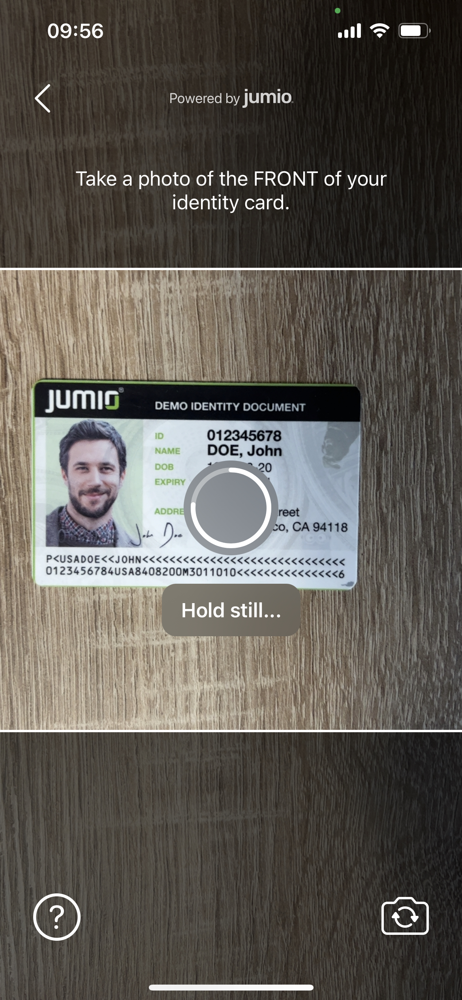
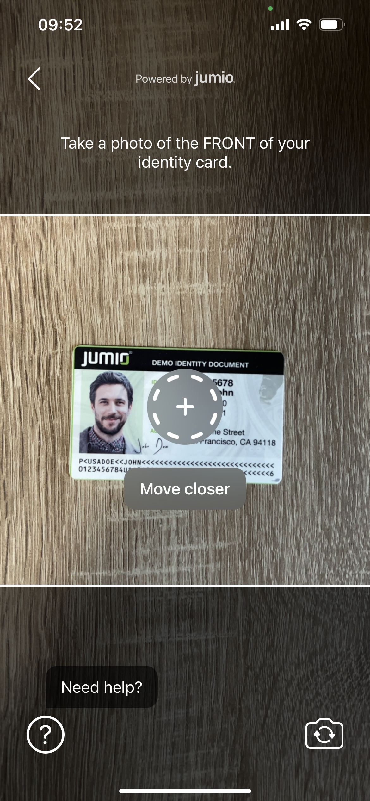
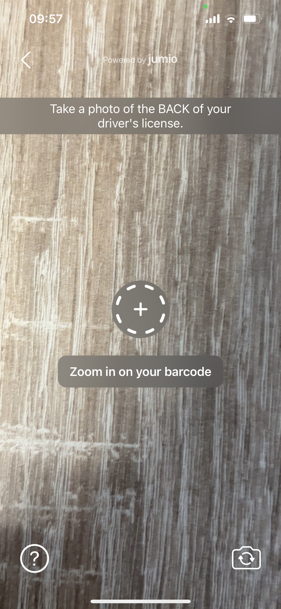
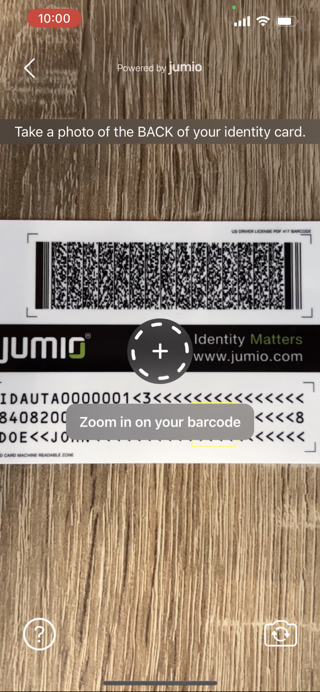
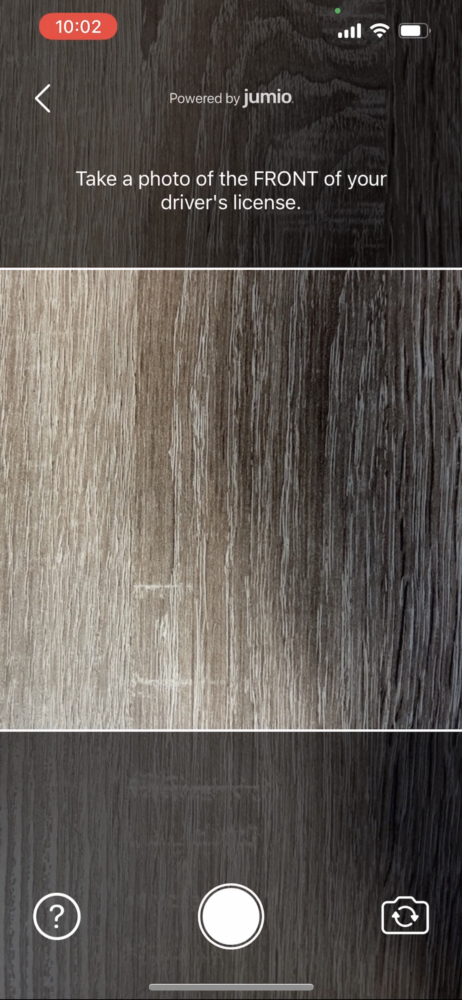

# FAQ

## Table of Contents
- [User Consent](#user-consent)
- [Apple Privacy Guidelines](#apple-privacy-guidelines)
- [Autocapture](#autocapture)
- [Improving User Experience and Reduce Drop-off Rate](#improve-user-experience-and-reduce-drop-off-rate)
- [Managing Errors](#managing-errors)
- [Reducing the Size of Your App](#reducing-the-size-of-your-app)
	- [Strip Unused Frameworks](#strip-unused-frameworks)
	- [Bitcode](#bitcode)
- [Jumio Authentication Workflow Integration](#jumio-authentication-workflow-integration)
- [Fallback and Manual Capturing](#fallback-and-manual-capturing)
- [Language Localization](#language-localization)
- [Overview of Scanning Methods](#overview-of-scanning-methods)
- [Glossary of Commonly Used Abbreviations ](#glossary)
- [Simulator Support](#simulator-support)
- [Jumio Support](#jumio-support)

## User Consent
User consent is now acquired for all users to ensure the accordance with biometric data protection laws. Depending on the legal requirements, consent can be acquired in one of two ways: __Active__ or __passive__.

For __active__ consent instances, the user needs to accept the consent items explicitly, e.g. by enabling a UI switch or checking a checkbox for each consent item. For __passive__ consent instances, it is enough to present the consent text and URL to the user. The user implicitly accepts the passive consent items by continuing with the journey.

## Apple Privacy Guidelines

At WWDC23 Apple introduced new privacy manifest and signature for third-party software development kits (SDKs) and announced that developers will need to declare approved reasons for using a set of APIs in their app’s privacy manifest. These changes help app developers better understand how third-party SDKs use data, secure software dependencies, and provide additional privacy protection for end users.
On March 13, 2024, App updates or new Apps added to App Store Connect that use an API requiring approved reasons, Apple will send an email if  the app’s privacy manifest is missing any reason. 
On May 1, 2024, App updates or new Apps added to App Store Connect should comply with the Apple Privacy Guidelines.

After the WWDC23 announcement, the requested changes were applied and released with Jumio SDK 4.6.1. Starting from Jumio SDK 4.6.1 and the versions released afterward, Jumio frameworks follow the privacy guidelines requested from Apple.

Apple also published a list of most commonly used third-party SDKs. Any version of a listed SDK, as well as any SDKs that repackage those on the list, must contain a privacy manifest and a signature.
One of Jumio SDK optional dependencies, iProov, uses one of the SDKs mentioned in the list, Starscream. iProov SDK provided new releases v11.0.3 and v10.3.3 which follow the privacy guidelines. The new iProov version was included in Jumio SDK 4.9.0. Jumio SDK also included the updated iProov SDK in the versions 4.6.2, 4.7.1 and 4.8.1. 

Jumio frameworks follow Apple privacy guidelines starting from version 4.6.1 and onwards.
Jumio frameworks and Jumio optional dependencies (iProov) follow Apple privacy guidelines on version 4.6.2, 4.7.1, 4.8.1, 4.9.0 and onwards.

## Autocapture

The new Autocapture experience allows users to capture multiple images within a single camera session. For example the user can be guided to first capture the front of a document, then flip the document and capture the back of a document.

https://user-images.githubusercontent.com/27801945/232710790-9caf1be0-145e-4cf6-b1ff-5a7b98d4ab66.mov

## Improve User Experience and Reduce Drop-off Rate
When evaluating user flows, one of the most commonly used metrics is the rate of drop-offs. At Jumio, we see considerable variance in drop-off rates across industries and customer implementations. For some implementations and industries, we see a higher rate of drop-offs on the first screens when compared with the average.
Scanning an ID with sensitive personal data printed on it naturally creates a high barrier for participation on the part of the end user. Therefore, conversion rates can be significantly influenced when the application establishes a sense of trust and ensures that users feel secure sharing their information.

One pattern that is recognizable throughout all of our customers’ SDK implementations: the more seamless the SDK integration, and the better job is done of setting user expectations prior to the SDK journey, the lower the drop-off rate becomes.

Our SDK provides a variety of [customization options](integration_guide.md#customization) to help customers achieve a seamless integration. For customers using the standard SDK workflow, our [Surface tool](https://jumio.github.io/surface-tool/) provides an easy-to-use WYSIWYG interface to see simple customization options that can be incorporated with minimal effort and generate the code necessary to implement them. For customers who want to have more granular control over look and feel, our SDK offers the [CustomUI](integration_guide.md#custom-ui) option, which allows you to customize the entire user interface.

### Example of a Non-Ideal SDK Integration:

- Default SDK UI is used and is presented on one of the first screens during onboarding. The user is unprepared for the next steps and might not understand the intention behind the request to show their ID.

### Suggested Improvements with Additional Customization:

 - Host application has an explanatory help screen that explains what will happen next and why this information is needed.
 - In `multipart` ScanParts, the user is guided to move to the next part (e.g. back side of the identity card) with an animation. The extraction should be disabled during this guidance.
 - SDK is either customized to have a more embedded appearance or [CustomUI](integration_guide.md#custom-ui) is used to create a completely seamless integration in the UX of our customers.
 - Also after the Jumio workflow that shows the displayed results and/or a message that the ID is currently verified, which might take some minutes.

## Managing Errors
Not every error that is returned from the SDK should be treated the same. The error codes listed for [ID Verification](integration_guide.md#error-codes) should be handled specifically.

The following table highlights the most common error codes which are returned from the SDK and explains how to handle them appropriately in your application.

| Code   | Cause    | Recommended Handling         |
| :----: | :------- | :--------------------------- |
| A[xx][yyyy] | Caused by temporary network issues like a slow connection. | Advise to check the signal and retry the SDK journey. |
| E[xx][yyyy] | Flight mode is activated or no connection available. | The user should be asked to disable flight mode or to verify if the phone has proper signal. Advise to connect to WIFI and retry the SDK journey afterwards. |
| G[00][0000] | The user pressed back or X to exit the SDK while no error view was presented. | Reasons for this could be manyfold. Often it might be due to the fact that the user didn't have his identity document at hand. Give the user the option to retry. |
| J[xx][yyyy] | The SDK journey was not completed within the session's max. lifetime. (The default is 15 minutes.) | The user should be informed about the timeout and be directed to start a new Jumio SDK session. |

### Ad blockers or Firewall
End users might face the situation where they are connected to a network that can't reach our Jumio endpoints.
Possible reasons for this might be ad blockers on the device, network wide ad blockers or network specific firewall settings.
In these cases the SDK will return a specific error code: A10900. If this error is received we suggest to add a screen where the user is advised to switch network and/or turn off possible ad blockers.

## Reducing the Size of Your App
The Netverify SDK contains a wide range of different scanning methods. The SDK is able to capture identity documents and extract information on the device using enhanced machine learning and computer vision technologies. If you want to reduce the size of the SDK within your application, there are several ways to achieve this:

### Strip Unused Frameworks
Depending on your specific needs, you may want to strip out unused functionality. As most of our frameworks can be linked optionally, you can reduce file size by simply not adding them to your project.

The following table shows a range of different product configurations with the frameworks that are required and the corresponding application size. These measurements reflect the extra size that Jumio components add to your app download size and are based on our [sample application](../sample) after being uploaded to the [Appstore](https://apps.apple.com/us/app/jumio-showcase/id639531180).

| Product Configuration      | Size   | Modules |
| :------------------------- | :----: | :-----: |
| Slim                       | 1.85 MB | base          |
| All                        | 3.73 MB | base, nfc     |
| All + DefaultUI            | 4.37 MB | base, nfc, defaultUI    |
| All + IProov               | 7.58 MB | base, nfc, iproov    |
| All + Datadog              | 4.93 MB | base, nfc, datadog       |
| All + Liveness             | 6.42 MB | base, nfc, liveness       |

In case you use a combination of these products, make sure to add frameworks only once to your app and that those frameworks are linked and embedded in your Xcode project.

## Jumio Authentication Workflow Integration
Jumio Authentication can be used for any use case in which you want your end-users to confirm their identities. As a result of the Authentication journey you get a success or failed result back from the SDK or from our server (callback or retrieval).

In case of a __successful result__ you can grant the user access to your service or let him proceed with the user flow. In case of a __failed result__, a proper retry handling within your workflow is necessary. A failure could occur because of the following reasons:
* The user presenting their face is a different one than the user who owns the account
* An imposter is trying to spoof the liveness check
* User does not want to show their face at all, but is still trying to complete the onboarding
* User does not look straight into the camera
* User does not finish the first or second step of face scan
* User has bad lighting conditions (too dark, too bright, reflections on face, not enough contrast, …)
* User is covering (parts) of their face with a scarf, hat or something similar
* A different person is scanning their face in the second step than in the first one
* User is not able to align his face with the oval presented during scanning

In case an Authentication fail is returned, we recommend to allow the user between 3-5 Authentication attempts to prove their identity, before you lock the user from performing the action. This approach makes the most sense, as you don't want to lock out possible valid users who might not have completed the face capture task successfully for a legitimate reason. Don't worry about offering a potential fraudster more attempts to gain access to your system - our bullet proof liveness check does not allow them to get a successful result.

## Fallback and Manual Capturing
The variable [`hasFallback`](https://jumio.github.io/mobile-sdk-ios/Jumio/Structs/Jumio/Scan/Part.html#/s:5JumioAAV4ScanV4PartC11hasFallbackSbvp) determines if a fallback for the current scan mode is available and returns a boolean. If the method returns true, the available fallback scan mode will have to be started with the method [`fallback()`](https://jumio.github.io/mobile-sdk-ios/Jumio/Structs/Jumio/Scan/Part.html#/s:5JumioAAV4ScanV4PartC8fallbackyyF).

The variable [`isShutterEnabled`](https://jumio.github.io/mobile-sdk-ios/Jumio/Classes/JumioScanView.html#/s:5Jumio0A8ScanViewC16isShutterEnabledSbvp) determines if a shutter button needs to be shown because the image has to be taken manually and returns a boolean. If the method returns true, you will have to display your own shutter button and call the method [`takePicture()`](https://jumio.github.io/mobile-sdk-ios/Jumio/Classes/JumioScanView.html#/s:5Jumio0A8ScanViewC11takePictureyyF) once it is clicked.

__Note:__ Please note that the variable `isShutterEnabled` does neither create nor display the actual shutter button!

"Manual capturing" simply refers to the user being able to manually take a picture. "Fallback" refers to an alternative scan mode the SDK can resort to if possible, in case there is an issue during the original scanning process. The fallback scan mode might be manual capturing in some cases, but not all.

## Language Localization
Our SDK supports localization for different languages and cultures. All label texts and button titles can be changed and localized using the `Localizable-Jumio.strings` file. Just adapt the values to your required language, add it to your app or framework project and mark it as Localizable.

This way, when upgrading our SDK to a newer version your localization file won't be overwritten. Make sure, that the content of this localization file is up to date after an SDK update. If you're having issues with Localization, please refer to our [Known Issues](known_issues.md#language-localization-issues)

__Note:__ If using CocoaPods, the original file is located under `/Pods/Jumio/Localization`.

Currently, the following languages are automatically supported for your convenience: [supported languages](../README.md#language-localization)

Runtime language changes *within* the SDK or separate language support (meaning the SDK language differs from the overall device languages) is not possible.

### Accessibility
Our SDK supports accessibility features. Visually impaired users can enable __VoiceOver__ or increase __text size__ on their device. VoiceOver uses separate values in the localization file, which can be customized.

## Overview of Scanning Methods

#### Autocapture
Combines all previously existing scanning methods into one automatic, seamless experience.

#### Barcode
PDF417 barcode data extraction, for example from US and Canadian driver licenses.

#### Manual Capture
Manual scanning (taking a picture) using the shutterbutton, fallback option in case user is having trouble.

## Glossary
A [quick guide to commonly used abbreviations](integration_glossary.md) throughout the documentation which may not be all that familiar.

## Simulator Support
We don't support the use of the Jumio SDK on simulator, please only run it on physical devices. When running Jumio SDK in Default UI, an empty ViewController will be presented. When running Jumio SDK in Custom UI, the SDK won't provide any functionality.

## Jumio Support
The Jumio development team is constantly striving to optimize the size of our frameworks while increasing functionality, to improve your KYC and to fight fraud. If you have any further questions, please reach out to our [support team](mailto:support@jumio.com).
