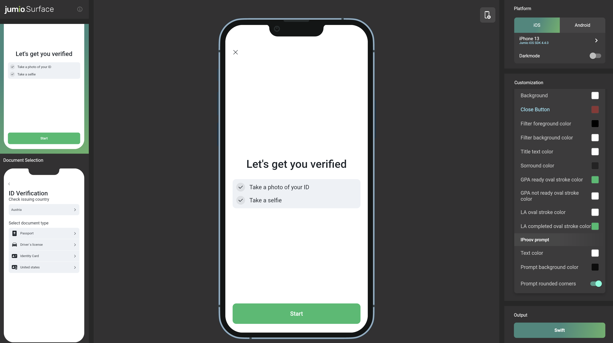

# Integration Guide for iOS SDK
Jumio’s products allow businesses to establish the genuine identity of their users by verifying government-issued IDs in real-time. ID Verification, Identity Verification and other services are used by financial service organizations and other leading brands to create trust for safe onboarding, money transfers, and user authentication.

## Table of Contents
- [Release Notes](#release-notes)
- [Setup](#setup)
- [Initialization](#initialization)
- [Configuration](#configuration)
- [Customization](#customization)
- [SDK Workflow](#sdk-workflow)
- [Custom UI](#custom-ui)
  - [Instant Feedback](#instant-feedback)
- [Callback](#callback)
- [Code Documentation](https://jumio.github.io/mobile-sdk-ios/Jumio/)

## Release Notes
Please refer to our [Change Log](changelog.md) for more information. Current SDK version: __4.1.0__

For breaking technical changes, please read our [Transition Guide](transition_guide.md).

## Setup
The [basic setup](../README.md#basics) is required before continuing with the following setup for the Jumio SDK.

### NFC Setup
To make our SDK capable of reading NFC chips you will need to set the following settings:

Add the Near Field Communication Tag Reading capability to your project, App ID and provisioning profiles in [Apple Developer portal](https://developer.apple.com).
Add `NFCReaderUsageDescription` to your __info.plist__ file with a proper description of why you are using this feature. You will also need to add the following key and value to your plist file to be able to read NFC chips from passports:
```
<key>com.apple.developer.nfc.readersession.iso7816.select-identifiers</key>
<array>
    <string>A0000002471001</string>
</array>
```

#### SDK Version Check
Use `Jumio.SDK.version` to check which SDK version is being used.


### Jailbreak Detection
For security reasons, applications implementing the SDK should not run on jailbroken devices. Use either the below method or a self-devised check to prevent usage of SDK scanning functionality on jailbroken devices.
```
Jumio.SDK.isJailbroken
```

⚠️&nbsp;&nbsp;__Note:__ Please be aware that the JumioSDK jailbreak check uses various mechanisms for detection, but doesn't guarantee to detect 100% of all jailbroken devices.

### Build Settings
For security reasons, you should set the following build settings:
To generate a position independent executable, the build settings "Generate Position-Dependent Executable" and "Generate Position-Dependent Code" should both be set to "No".
For Objective-C projects, you should enable stack canaries by adding "-fstack-protector-all" to "Other C Flags".
For Objective-C projects, you should set "Objective-C Automatic Reference Counting" to "Yes".

## Initialization
Your OAuth2 credentials are constructed using your previous API token as the Client ID and your previous API secret as the Client secret. You can view and manage your Client ID and secret in the Customer Portal under:
* __Settings > API credentials > OAuth2 Clients__

Client ID and Client secret are used to generate an OAuth2 access token. OAuth2 has to be activated for your account. Contact your Jumio Account Manager for activation. Send a workflow request using the acquired OAuth2 access token to receive the SDK token necessary to initialize the Jumio SDK. For more details, please refer to [Authentication and Encryption](../README.md#authentication-and-encryption).

```
sdk = Jumio.SDK()
sdk.token = "YOUR_SDK_TOKEN"
sdk.dataCenter = jumioDataCenter
```

Make sure that your SDK token is correct. If it isn't, an exception will be thrown. Then provide a reference to identify the scans in your reports (max. 100 characters or `null`). Data center is set to `JumioDataCenter.US` by default. If your customer account is in the EU data center, use `JumioDataCenter.EU` instead. Alternatively, use `JumioDataCenter.SG` for Singapore.

⚠️&nbsp;&nbsp;__Note:__ We strongly recommend storing all credentials outside of your app! We suggest loading them during runtime from your server-side implementation.

Make sure initialization and presentation are timely within one minute. On iPads, the presentation style `UIModalPresentationFormSheet` is default and mandatory.
```
self.present(netverifyVC, animated: true, completion: nil)
```

## Configuration
Every Jumio SDK instance is initialized using a specific `sdk.token`. This token contains information about the workflow, credentials, transaction identifiers and other parameters. Configuration of this token allows you to provide your own internal tracking information for the user and their transaction, specify what user information is captured and by which method, as well as preset options to enhance the user journey. Values configured within the `sdk.token` during your API request will override any corresponding settings configured in the Customer Portal.

### Workflow Selection
Use ID verification callback to receive a verification status and verified data positions (see [API v3 Callback section](https://github.com/Jumio/implementation-guides/blob/master/api-guide/api_guide.md#callback)). Make sure that your customer account is enabled to use this feature. A callback URL can be specified for individual transactions (for URL constraints see chapter [Callback URL](https://github.com/Jumio/implementation-guides/blob/master/api-guide/api_guide.md#jumio-callback-ip-addresses)). This setting overrides any callback URL you have set in the Jumio Customer Portal. Your callback URL must not contain sensitive data like PII (Personally Identifiable Information) or account login. Set your callback URL using the `callbackUrl` parameter.

Use the correct [workflow definition key](https://github.com/Jumio/implementation-guides/blob/master/api-guide/api_guide.md#workflow-definition-keys) in order to request a specific workflow. Set your key using the `workflowDefinition.key` parameter. For example: Use [workflow 2 "ID Verification"](https://github.com/Jumio/implementation-guides/blob/master/api-guide/workflow_descriptions.md#workflow-2-id-verification) to verify an ID document and extract data from that document. Use [workflow 3 "ID and Identity Verification"](https://github.com/Jumio/implementation-guides/blob/master/api-guide/workflow_descriptions.md#workflow-3-id-and-identity-verification) to verify a photo ID document and extract data from that document, as well as compare the user's face with the photo on the ID and perform a liveness check to ensure the person is physically present.

```
'{
  "customerInternalReference": "CUSTOMER_REFERENCE",
  "workflowDefinition": {
    "key": X,
  },
  "callbackUrl": "YOUR_CALLBACK_URL"
}'
```

For more details, please refer to our [Workflow Description Guide](https://github.com/Jumio/implementation-guides/blob/master/api-guide/workflow_descriptions.md).

Identity Verification has to be activated for your account. If you use Identity Verification, make sure the necessary frameworks are linked to your app project:
* `iProov.framework`
* `Starscream.framework` (iProov dependency)
* `SocketIO.framework` (iProov dependency)

ℹ️&nbsp;&nbsp;__Note:__ Identity Verification requires portrait orientation in your app.

### Transaction Identifiers
There are several options in order to uniquely identify specific transactions. `customerInternalReference` allows you to specify your own unique identifier for a certain scan (max. 100 characters). Use `reportingCriteria`, to identify the scan in your reports (max. 100 characters). You can also set a unique identifier for each user using `userReference` (max. 100 characters).

For more details, please refer to our [API Guide](https://github.com/Jumio/implementation-guides/blob/master/api-guide/api_guide.md#request-body).

```
'{
  "customerInternalReference": "CUSTOMER_REFERENCE",
  "workflowDefinition": {
    "key": X,
  },
  "reportingCriteria": "YOUR_REPORTING_CRITERIA",
  "userReference": "YOUR_USER_REFERENCE"
}'
```

⚠️&nbsp;&nbsp;__Note:__ Transaction identifiers must not contain sensitive data like PII (Personally Identifiable Information) or account login.

### Preselection
You can specify issuing country using [ISO 3166-1 alpha-3](https://en.wikipedia.org/wiki/ISO_3166-1_alpha-3) country codes, as well as ID types to skip selection during the scanning process. In the example down below, Austria ("AUT") and the USA ("USA") have been preselected. PASSPORT and DRIVER_LICENSE have been chosen as preselected document types. If all parameters are preselected and valid and there is only one given combination (one country and one document type), the document selection screen in the SDK can be skipped entirely.

For more details, please refer to our [API Guide](https://github.com/Jumio/implementation-guides/blob/master/api-guide/api_guide.md#request-body).

```
'{
  "customerInternalReference": "CUSTOMER_REFERENCE",
  "workflowDefinition": {
    "key": X,
    "credentials": [
      {
        "category": "ID",
        "type": {
          "values": ["DRIVING_LICENSE", "PASSPORT"]
        },
        "country": {
          "values": ["AUT", "USA"]
        }
      }
    ]
  }
}'
```

### Miscellaneous
Use `cameraFacing` attribute of `Jumio.Scan.View` to configure the default camera and set it to `front` or `back`.
```
scanView.cameraFacing = .front
```

## Customization

### Customization Tool
##### ⚠️&nbsp;&nbsp;__Note:__ Please be aware that the Surface Tool is not yet supported for SDK 4.1.0, but will be available soon.  
[Jumio Surface](https://jumio.github.io/surface-ios) is a web tool that allows you to apply and visualize, in real-time, all available customization options for the Jumio SDK, as well as an export feature to import the applied changes straight into your codebase.

[](https://jumio.github.io/surface-ios)

Use the tab __Customize SDK__ to check out all the screens and adapt the look & feel of the SDK to your needs.

The __Objective-C Code__ or __Swift Code__ tab to visualizes all the colors that can be customized. As visualized in the code there, the SDK can be customized to fit your application's look and feel via the UIAppearance pattern. Just add the automatically generated code from the Surface tool to your XCode project.

## SDK Workflow
Implement the delegate methods of the [`DefaultUIDelegate`]() protocol to be notified of successful initialization, successful scans, and errors. Dismiss the `Jumio.ViewController` instance in your app in case of success or error.

### Initialization
When this method is fired, the SDK has finished initialization and loading tasks, and is ready to use. The error object is only set when an error has occurred (e.g. wrong credentials are set or a network error occurred).
```
sdk.startDefaultUI()
```

### Success
Upon success, the extracted document data is returned within a `Jumio.Result` object that includes `workflowExecutionId` and `accountId`. The parameter `isSuccess` will be `true`.
```
func jumio(sdk: Jumio.SDK, finished result: Jumio.Result) {
        delegate?.defaultUIDidFinish(with: result)
}
```

### Error
A workflow will result in an error when the user presses the cancel button during the workflow or in an error situation. `Jumio.Result` returns `workflowExecutionId` and `accountId`. It will also return a `Jumio.Error` object, which contains an error code and error message. The parameter `isSuccess` will be `false`.
```
func jumio(sdk: Jumio.SDK, finished result: Jumio.Result) {
        delegate?.defaultUIDidFinish(with: result)
}
```

### Retrieving information
The following tables give information on the specification of all data parameters and errors.

#### Class ___Jumio.IDResult___
| Parameter          | Type  	    | Max. length  | Description      |
|:-------------------|:-----------|:-------------|:-----------------|
| issuingCountry     | String     |	3            | Country of issue as [ISO 3166-1 alpha-3](https://en.wikipedia.org/wiki/ISO_3166-1_alpha-3) country code |
| idType             | String     |              | PASSPORT, DRIVER_LICENSE, IDENTITY_CARD or VISA as provided or selected |
| firstName          | String     |	100	         | First name of the customer |
| lastName           | String     |	100	         | Last name of the customer |
| dateOfBirth        | String     |		           | Date of birth |
| issuingDate        | String     |	             | Date of issue |
| expiryDate         | String     |	             | Date of expiry |
| documentNumber     | String     |	100	         | Identification number of the document |
| personalNumber     | String     |	14           | Personal number of the document |
| gender             | String     |		           | Gender M, F or X |
| nationality        | String     |              | Nationality of the customer |
| placeOfBirth       | String     |	255	         | Place of birth	|
| country            | String     |              | Country of residence |
| address            | String     |	64	         | Street name of residence |
| city               | String     |	64	         | City of residence |
| subdivision        | String     |	3            | Last three characters of [ISO 3166-2:US](https://en.wikipedia.org/wiki/ISO_3166-2:US) or [ISO 3166-2:CA](https://en.wikipedia.org/wiki/ISO_3166-2:CA) subdivision code	|
| postalCode         | String     |	15           | Postal code of residence |
| mrzLine1           | String     |	50           | MRZ line 1	|
| mrzLine2           | String     | 50           | MRZ line 2	|
| mrzLine3           | String     |	50           | MRZ line 3	|
| rawBarcodeData     | String     |	50           | Extracted barcode data	|
| extractionMethod   | Jumio.Scan.Mode  |          | Extraction method used during scanning (linefinder, manual, face_iproov, face_manual, barcode, mrz) |
| imageData          | Jumio.ImageData |          | Wrapper class for accessing image data of all scan sides from an ID verification session. This feature has to be enabled by your account manager. |

#### Class ___Jumio.FaceResult___
|Parameter  |Type 	  | Max. length | Description      |
|:----------|:--------|:------------|:-----------------|
| passed    |	Boolean |	          	|
| extractionMethod | Jumio.Scan.Mode  | | Extraction method used during scanning (faceManual, faceIProov) |
| imageData | Jumio.ImageData | | Wrapper class for accessing image data of all scan sides from an ID verification session. This feature has to be enabled by your account manager. |

#### Class ___Jumio.RejectReason___
List of all possible reject reasons returned if Instant Feedback is used:   

| Code          | Message  | Description      | Already Active |
|:--------------|:---------|:-----------------|:--------------:|
| 102  | blackWhiteCopy    | Document appears to be a black and white photocopy | x |
| 103  | colorPhotocopy    | Document appears to be a colored photocopy | |
| 104  | digitalCopy       | Document appears to be a digital copy | |
| 200  | notReadable       | Document is not readable | |
| 201  | noDoc             | No document could be detected | x |
| 206  | missingBack       | Backside of the document is missing | x |
| 214  | missingFront      | Frontside of the document is missing | x |
| 2001 | blurry            | Document image is unusable because it is blurry | x |
| 2003 | missingPartDoc    | Part of the document is missing | x |
| 2005 | damagedDocument   | Document appears to be damaged | |
| 2004 | hiddenPartDoc     | Part of the document is hidden | |
| 2006 | glare             | Document image is unusable because of glare | x |

#### Error Codes
List of all **_error codes_** that are available via the `code` and `message` property of the `Jumio.Error` object. The first letter (A-Z) represents the error case. The remaining characters are represented by numbers that contain information helping us understand the problem situation ([x][yyyy]).

| Code | Message  | Description |
| :----------------------------: |:-------------|:-----------------|
| A[x][yyyy]| We have encountered a network communication problem | Retry possible, user decided to cancel |
| B[x][yyyy]| Authentication failed | Secure connection could not be established, retry impossible |
| C[x]0401 | Authentication failed | API credentials invalid, retry impossible |
| E[x]0000 | No Internet connection available | Retry possible, user decided to cancel |
| F00000 | Scanning not available at this time, please contact the app vendor | Resources cannot be loaded, retry impossible |
| G00000 | Cancelled by end-user | No error occurred |
| H00000 | The camera is currently not available | Camera cannot be initialized, retry impossible |
| I00000 | Certificate not valid anymore. Please update your application | End-to-end encryption key not valid anymore, retry impossible |
| J00000 | Transaction already finished | User did not complete SDK journey within session lifetime |
| N00000 | Scanning not available at this time, please contact the app vendor | Required images are missing to finalize the acquisition |
| Y00000 | The barcode of your document didn´t contain your address, turn your document and scan the front. | __Only Custom UI:__ Scanned Barcode (e.g. US Driver License) does not contain address information. Show hint and/or call `retryAfterError` |
| Z00000 | You recently scanned the front of your document. Please flip your document and scan the back. | __Only Custom UI:__ Backside of the document was scanned but most likely the frontside of the document was detected. Show hint and/or call `retryAfterError` |

⚠️&nbsp;&nbsp;__Note:__ Please always include the whole error code when filing an error related issue to our support team.

## Custom UI
ID Verification can also be implemented as a __custom scan view.__ This means that only the scan view controllers (including the scan overlays) are provided by the SDK.
The handling of the lifecycle, document selection, readability confirmation, error handling, and all other steps necessary to complete a scan have to be handled by the client application that implements the SDK.

The following sequence diagram outlines components, callbacks and functions for a basic ID Verification workflow:


Custom UI enables you to create and use a custom scan view with a plain scanning user interface. In order to do that, initialize the SDK instance by setting `sdk.token` and `sdk.dataCenter`. Specify a `delegate` instance which creates a `Jumio.Controller`.

⚠️&nbsp;&nbsp;__Note:__ Instead of the `delegate` property, `customUIDelegate` has to be set in the configuration object.

```
sdk = Jumio.SDK()
sdk?.token = "YOUR_SDK_TOKEN"
sdk?.dataCenter = jumioDataCenter
```

* `JumioDataCenter` values: `US`, `EU`, `SG`

Create a `Jumio.Controller` instance and start the SDK by passing it to the controller:

```
var controller = Jumio.Controller?
controller = sdk?.start(sdk: sdk)
```

### Controller Handling
Once the controller is initialized, the following delegate methods will be available to handle credentials:

```
func jumio(controller: Jumio.Controller, didInitializeWith credentialInformations: [Jumio.Credential.Info], policyUrl: String?)

// result handling
func jumio(controller: Jumio.Controller, finished result: Jumio.Result)
func jumio(controller: Jumio.Controller, error: Jumio.Error)
func jumio(controller: Jumio.Controller, logicalError: Jumio.LogicalError)
```

If a user’s consent is required, the parameter `policyUrl` will provide a valid URL that will redirect the user to Jumio’s consent details. User can open and continue to this link if they choose to do so. If the user consents to the Jumio policy, `controllerHandling?.userConsented()` is required to be called internally before any credential can be initialized and the user journey can continue. If no consent is required, the parameter `policyUrl` will be null.

⚠️&nbsp;&nbsp;__Note:__ Please be aware that in cases where `policyUrl` is not null, the user is __legally required__ to __actually consent__ to Jumio's policy. Do not accept automatically without showing the user any terms.

### Credential Handling
`Jumio.Credential` will contain all necessary information about the scanning process. For ID verification you will receive an `IDCredential`, for Identity Verification a `FaceCredential`, and so on. Initialize the credential and check if it is already preconfigured. If this is the case, the parameter `isConfigured` will be `true` and the credential can be started right away.

 ```
var currentCredential: Jumio.Credential?
currentCredential = controller?.start(credentialInfo: currentCredentialInfo)

if currentCredential?.isConfigured {
    scanSides = currentCredential?.scanSides
    // start next scan part
}
```

If the credential is not yet configured, configuration needs to be set before scanning can be initialized for available countries. In case of ID verification, all available countries for a specific `IDCredential` are returned in `countries` parameter of the individual credential. Use `isSupportedConfiguration()` function to check if a certain configuration (e.g. a specific combination of country and documents) is supported for a certain ID credential. Use `setConfiguration()` to set a valid country / document combination:

```
currentCredential.isSupportedConfiguration(country: country, document: document) else { return }
currentCredential.setConfiguration(country: country, document: document)
```

#### Jumio ID Credential
In case of `Jumio.IDCredential`, query the available country and document combinations by checking the countries map provided by the credential. After that, specify country and document details by setting the credential configuration to receive all relevant scan parts for your chosen document.

Set a valid country / document combination from that list:
```
guard let idCredential = credential as? Jumio.IDCredential,
    idCredential.setConfiguration(country: country, document: document)
```

* `Jumio.Credential.Category` values = `id`, `face`, `document`

* `JumioDocument` values: `JumioDocumentType`, `JumioDocumentVariant`

* `JumioDocumentType` values: `passport`, `visa`, `drivingLicense`, `identityCard`

* `JumioDocumentVariant` values: `paper`, `plastic`

Retrieve the first scan side of the credential to start the scanning process by calling:
```
var scanSides: [Jumio.Scan.Side]?
scanSides = currentCredential?scanSides
```

Check if current Scan.Side is the first one:
```
var index = scanSides?.firstIndex { $0 == previousScanSide } ?? 0
index += previousScanSide != nil ? 1 : 0
guard let scanSide = scanSides?[index] else { return }
```

### ScanPart Handling
The following sequence diagram outlines an overview of ScanPart handling details:


Start the scanning process by initializing the scan part. Provide a `Jumio.Scan.Side` from the list below:

* `Jumio.Scan.Mode` values: `manual`, `faceManual`, `lineFinder`, `barcode`, `mrz`, `faceIProov`

* `Jumio.Scan.Side` values: `front`, `back`, `face`

When the scanning is done, the parameter `Jumio.Scan.Step.canFinish` will be received and the scan part can be finished by calling `currentScanPart?.finish()`.

To see if the finished scan side was the last one of the credential, check `currentScanSide == currentCredential?.scanSides?.last()` Check if the credential is complete by calling `currentCredential?.isComplete` and finish the current credential by calling `currentCredential?.finish()`.

Continue that procedure until all necessary credentials (e.g. `id`, `face`, `document`) are finished. Check if the last credential is finished with:

```
var index = scanSides?.firstIndex { $0 == previousScanSide } ?? 0
index += previousScanSide != nil ? 1 : 0
guard let scanSide = scanSides?[index] else { return }
```

Then call `controller?.finish()` to end the user journey.

During the scanning process, use the `scanPart` delegate method to check on the scanning progress. The scan step `canFinish` indicates that the scanning process for this part is done.

`Jumio.Scan.Step` covers lifecycle events which require action from the customer to continue the process.

* `Jumio.Scan.Step` values: `prepare`, `started`, `scanView`, `imageTaken`, `processing`, `confirmationView`, `retry`, `canFinish`, `rejectView`

`prepare` is only sent if a scan part requires upfront preparation and the customer should be notified (e.g. by displaying a loading screen). `started` is always sent when a scan part is started. If a loading view was triggered before, it can now be dismissed,

`imageTaken` is triggered as soon as the image is taken. The camera preview is stopped during that step.

When background processing is executed, `Jumio.Scan.Step.processing` is triggered.

When a confirmation view should be displayed, depending on the outcome either `Jumio.Scan.Step.confirmationView` or `Jumio.Scan.Step.rejectView` is displayed. To display the ScanPart in the confirmation or reject view, simply attach the views once the steps are triggered:

```
func onScanStep(_ step: Internal.Scan.Step, data: Any?) {
  switch step {
  case .confirmationView:
    if let scanPart = self.scanPart {
      confirmationView?.attach(scanPart: scanPart)
      delegate?.showConfirmationView()
    }
  case .rejectView:
    if let scanPart = self.scanPart {
      rejectView?.attach(scanPart: scanPart)
      delegate?.showRejectView()
    }
  }
}
```

The scan part can be confirmed by calling `scanPart?.confirm()` or the scan can be taken again: Either by calling `scanPart?.retake()` in case the scan attempt was successful, or by calling `scanPart?.rejectRetake()` in case the scan attempt was rejected. (Bad lighting conditions or glare, image was blurry, etc. ...)

The retry scan step returns a data object of type `Jumio.Retry.Reason`. On `retry`, a retry has to be triggered on the credential.
```
func onScanStep(_ step: Internal.Scan.Step, data: Any?) {
  case .retry:
    activeRetryReason = data as? Jumio.Retry.Reason
    var code = activeRetryReason?.code
    var message = activeRetryReason?.message
}
```

As soon as the scan part has been confirmed and all processing has been completed `canFinish` is triggered. `scanPart.finish()` can now be called. During the finish routine the SDK checks if there is an add-on functionality for this part available, e.g. possible NFC scanning after an MRZ scan part.

`Jumio.Scan.Update` covers scan information that is relevant and might need to be displayed during the scanning process.

* `Jumio.Scan.Update` values: `fallback`, `legalHint`

### Result and Error Handling
The method `jumio(controller: Jumio.Controller, finished result: Jumio.Result)` has to be implemented to handle data after a successful scan.

```
func jumio(controller: Jumio.Controller, finished result: Jumio.Result) {
        delegate?.controller(finished: result)
        // handle success case
    }
```

⚠️&nbsp;&nbsp;__Note:__ We recommend to hide any sensitive data, which you display to the user, when the app goes to the background. This includes the results you receive from us.

The delegate method `(controller: Jumio.Controller, error: Jumio.Error)` has to be implemented to handle data after an unsuccessful scan. Check the parameter `error.isRetryable` to see if the failed scan attempt can be retried. If an error is not retryable, the only possibility is to cancel the controller. This will result in a finished call with a `Jumio.Result` instance containing this error.

```
func jumio(controller: Jumio.Controller, error: Jumio.Error) {
    guard controller === self.controller else { return }
    guard error.isRetryable else {
        controller.cancel()
        return
    }
    ...
    // handle error case
}
```

The delegate method `(controller: Jumio.Controller, error: Jumio.LogicalError)` has to be implemented to handle data after an unsuccessful scan. This error case occurs whenever some kind of logical error occurs. (For example: `.deadCredential: Credential` is returned when a credential has already been finished or canceled and can’t execute any action anymore. Controller has to be finished or canceled before a new one can be initialized.

* `Jumio.LogicalError` values: `dependencyWrongVersion`, `notYetImplemented`, `deadController`, `errorNotRetryable`, `needToConsentFirst`, `controllerNotCompleted`, `isBeingFinished`, `multipleCredentials`, `unknownCredential`, `deadCredential`, `credentialNotCompleted`, `multipleScanParts`, `unknownScanPart`, `scanPartNotCompleted`, `deadScanPart`, `noFallbackAvailable`, `takePictureNotAllowed`

```
func jumio(controller: Jumio.Controller, logicalError: Jumio.LogicalError) {
        var logicalErrorMessage: String = ""
        switch logicalError {
        case .dependencyWrongVersion:
            logicalErrorMessage = "3rd party dependency have wrong version"
        case
          ...
          // handle error cases
        @unknown default:
            logicalErrorMessage = "unknown logical error reported"
        }
        delegate?.display(logicalErrorMessage: logicalErrorMessage)
    }
```

#### Instant Feedback
The use of Instant Feedback provides immediate end user feedback by performing a usability check on any image the user took and prompting them to provide a new image immediately if this image is not usable, for example because it is too blurry. Please refer to the [JumioRejectReason table](#class-jumiorejectreason) for a list of all reject possibilities.

# Security
All SDK related traffic is sent over HTTPS using TLS and public key pinning. Additionally, the information itself within the transmission is also encrypted utilizing __Application Layer Encryption__ (ALE). ALE is a Jumio custom-designed security protocol that utilizes RSA-OAEP and AES-256 to ensure that the data cannot be read or manipulated even if the traffic was captured.

# Support

## Licenses
The software contains third-party open source software. For more information, see [licenses](licenses).

This software is based in part on the work of the Independent JPEG Group.

## Contact
If you have any questions regarding our implementation guide please contact Jumio Customer Service at support@jumio.com. The [Jumio online helpdesk](https://support.jumio.com) contains a wealth of information regarding our services including demo videos, product descriptions, FAQs, and other resources that can help to get you started with Jumio.

## Copyright
&copy; Jumio Corporation, 395 Page Mill Road, Suite 150, Palo Alto, CA 94306

The source code and software available on this website (“Software”) is provided by Jumio Corp. or its affiliated group companies (“Jumio”) "as is” and any express or implied warranties, including, but not limited to, the implied warranties of merchantability and fitness for a particular purpose are disclaimed. In no event shall Jumio be liable for any direct, indirect, incidental, special, exemplary, or consequential damages (including but not limited to procurement of substitute goods or services, loss of use, data, profits, or business interruption) however caused and on any theory of liability, whether in contract, strict liability, or tort (including negligence or otherwise) arising in any way out of the use of this Software, even if advised of the possibility of such damage.

In any case, your use of this Software is subject to the terms and conditions that apply to your contractual relationship with Jumio. As regards Jumio’s privacy practices, please see our privacy notice available here: [Privacy Policy](https://www.jumio.com/legal-information/privacy-policy/).
