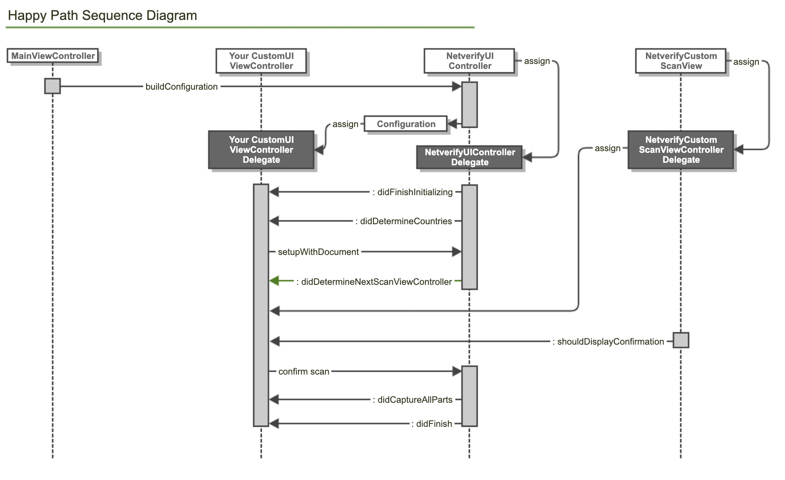

# ID Verification & Fastfill SDK for iOS
Jumio’s ID Verification allows businesses to establish the genuine identity of their users by verifying government-issued IDs in real-time. ID Verification is used by financial service organizations and leading brands to create trust for safe onboarding, money transfers, and user authentication.

## Table of Contents
- [Release Notes](#release-notes)
- [Setup](#setup)
- [Initialization](#initialization)
- [Configuration](#configuration)
- [Customization](#customization)
- [SDK Workflow](#sdk-workflow)
- [Custom UI](#custom-ui)
- [Callback](#callback)
- [Code Documentation](https://jumio.github.io/mobile-sdk-ios/Netverify/)

## Release Notes
Please refer to our [Change Log](changelog.md) for more information. Current SDK version: 3.9.2

For breaking technical changes, please read our [transition guide](transition-guide_id-verification-fastfill.md).

## Setup
The [basic setup](../README.md#basics) is required before continuing with the following setup for ID Verification.

### NFC Setup
To make our SDK capable to read NFC chips you will need to set the following settings.

Add the Near Field Communication Tag Reading capability to your project, App ID and provisioning profiles in [Apple Developer portal](https://developer.apple.com).
Add `NFCReaderUsageDescription` to your info.plist file with a proper description of why you are using this feature. You will also need to add the following key and value to your plist file to be able to read NFC chips from passports.
```
<key>com.apple.developer.nfc.readersession.iso7816.select-identifiers</key>
<array>
    <string>A0000002471001</string>
</array>
```

## Initialization
Log into your Jumio customer portal. You can find your customer API token and API secret on the __Settings__ page under __API credentials__ tab.

If the token and secret are not set in the [`NetverifyConfiguration`](https://jumio.github.io/mobile-sdk-ios/Netverify/Classes/NetverifyConfiguration.html) object, an exception will be thrown. Please note that in Swift you need to catch the underlying exception and translate it into a `NSError` instance.
Whenever an exception is thrown, the [`NetverifyViewController`](https://jumio.github.io/mobile-sdk-ios/Netverify/Classes/NetverifyViewController.html) instance will be nil and the SDK is not usable. Make sure that all necessary configuration is set before the `NetverifyConfiguration` instance is passed to the initializer.
```swift
let config:NetverifyConfiguration = NetverifyConfiguration()
config.apiToken = "YOUR_NETVERIFY_APITOKEN"
config.apiSecret = "YOUR_NETVERIFY_APISECRET"
config.dataCenter = JumioDataCenterUS
```

[__Swift sample__](../sample/SampleSwift/NetverifyStartViewController.swift#L57-L184) ||
[__Objective C sample__](../sample/SampleObjC/NetverifyStartViewController.m#L27-L90)

The default data center is JumioDataCenterUS. If your customer account is in the EU data center, use `JumioDataCenterEU` instead. Alternatively, use `JumioDataCenterSG` for Singapore.

__Note:__ We strongly recommend storing all credentials outside of your app!

Make sure initialization and presentation are timely within one minute. On iPads, the presentation style `UIModalPresentationFormSheet` is default and mandatory.
```swift
self.present(netverifyVC, animated: true, completion: nil)
```

[__Swift sample__](../sample/SampleSwift/NetverifyStartViewController.swift#L207-L215) ||
[__Objective C sample__](../sample/SampleObjC/NetverifyStartViewController.m#L180-L189)

### Jailbreak Detection
We advice to prevent our SDK to be run on jailbroken devices. Either use the method below or a self-devised check to prevent usage of SDK scanning functionality on jailbroken devices:
```swift
JumioDeviceInfo.isJailbrokenDevice()
```

[__Swift sample__](../sample/SampleSwift/NetverifyStartViewController.swift#L31-L34) ||
[__Objective C sample__](../sample/SampleObjC/NetverifyStartViewController.m#L22-L25)

## Configuration

### Tutorial
[Configuring behavior (Video):](https://share.vidyard.com/watch/3UPJyHrbXnuyY91aNpKEKW) How to configure the behavior of the app using SDK parameters

### ID verification
Use ID verification to receive a verification status and verified data positions (see [Callback for ID Verification](https://github.com/Jumio/implementation-guides/blob/master/netverify/callback.md#callback-for-netverify)). Ensure that your customer account is allowed to use this feature. A callback URL can be specified for individual transactions (for constraints see chapter [Callback URL](https://github.com/Jumio/implementation-guides/blob/master/netverify/portal-settings.md#callback-url)). This setting overrides any callback URL you have set in the Jumio Customer Portal.
```swift
config.callbackUrl = "YOURCALLBACKURL"
```

__Note:__ Not available for accounts configured as Fastfill only.


[__Swift sample__](../sample/SampleSwift/NetverifyStartViewController.swift#L100-L101) ||
[__Objective C sample__](../sample/SampleObjC/NetverifyStartViewController.m#L66-L67)

__Note:__ The callback URL must not contain sensitive data like PII (Personally Identifiable Information) or account login.

Set the following setting to switch to Fastfill mode (which performs data extraction only):
```swift
config.enableVerification = self.switchRequireVerification.isOn
```

[__Swift sample__](../sample/SampleSwift/NetverifyStartViewController.swift#L103-L104) ||
[__Objective C sample__](../sample/SampleObjC/NetverifyStartViewController.m#L69-L70)

Identity Verification is automatically enabled if it is activated for your account. Make sure to link the following frameworks to your app project:
* `JumioIProov.framework`
* `iProov.framework`
* `Starscream.framework` (iProov dependency)
* `SocketIO.framework` (iProov dependency)

Alternatively, to use Zoom instead of iProov, make sure to link:
* `NetverifyFace.framework`
* `ZoomAuthentication.framework`

Set the following setting to disable Identity Verification on a transaction level:
```swift
config.enableIdentityVerification = self.switchRequireFaceMatch.isOn
```

[__Swift sample__](../sample/SampleSwift/NetverifyStartViewController.swift#L106-L107) ||
[__Objective C sample__](../sample/SampleObjC/NetverifyStartViewController.m#L72-L73)

### Preselection
You can specify issuing country  (using [ISO 3166-1 alpha-3](https://en.wikipedia.org/wiki/ISO_3166-1_alpha-3) country codes), ID type(s) and/or document variant to skip their selection during the scanning process. In the example down below Austria ("AUT") has been preselected, as well as a specific document variant (NetverifyDocumentVariantPlastic), and added Passport and Visa as preselected document types. When all three parameters are preselected, the document selection screen in the SDK can be skipped entirely.

```swift
config.preselectedCountry = "AUT"
config.preselectedDocumentTypes = NetverifyDocumentType(rawValue: NetverifyDocumentType.all.rawValue)!

let documentTypes = UInt(NetverifyDocumentType.driverLicense.rawValue | NetverifyDocumentType.identityCard.rawValue | NetverifyDocumentType.passport.rawValue | NetverifyDocumentType.visa.rawValue)
config.preselectedDocumentTypes = NetverifyDocumentType(rawValue: documentTypes)!

config.preselectedDocumentVariant = .plastic
```

[__Swift sample__](../sample/SampleSwift/NetverifyStartViewController.swift#L71-L86) ||
[__Objective C sample__](../sample/SampleObjC/NetverifyStartViewController.m#L43-L52)

__Note:__ Fastfill does not support paper IDs, except German ID cards.

### Transaction Identifiers
The customer internal reference allows you to specify your own unique identifier for the scan (max. 100 characters).
```swift
config.customerInternalReference = "YOUR_SCAN_REFERENCE"
```

Use the following property to identify the scan in your reports (max. 100 characters).
```swift
config.reportingCriteria = "YOUR_REPORTING_CRITERIA"
```

You can also set a unique identifier for each user (max. 100 characters).
```swift
config.customerId = "YOUR_CUSTOMER_ID"
```

[__Swift sample__](../sample/SampleSwift/NetverifyStartViewController.swift#L88-L98) ||
[__Objective C sample__](../sample/SampleObjC/NetverifyStartViewController.m#L54-L59)

__Note:__ Transaction identifiers must not contain sensitive data like PII (Personally Identifiable Information) or account login.

### Jumio Watchlist Screening
You can set a watchlist screening on transaction level. Enable to override the default search, or disable the watchlist screening for this transaction. When enabled, you need to specify a search profile.
```swift
config.watchlistScreening = NetverifyWatchlistScreeningEnabled
config.watchlistSearchProfile = "YOUR_SEARCH_PROFILE"
```

### Analytics Service
Use the following setting to explicitly send debug information to Jumio.
```swift
config.sendDebugInfoToJumio = true
```

[__Swift sample__](../sample/SampleSwift/NetverifyStartViewController.swift#L118-L120) ||
[__Objective C sample__](../sample/SampleObjC/NetverifyStartViewController.m#L84-L86)

__Note:__ Only set this property to true if you are asked by Jumio Support.

When `sendDebugInfoToJumio` is enabled, you receive a list of the current DebugSessionID by using  `debugID`. This method should be called either shortly after initializing or before dismissing the SDK.

### Offline scanning
If you want to use the SDK in offline mode, please contact Jumio Support at support@jumio.com or https://support.jumio.com. Once this feature is enabled for your account, you can find your offline token in your Jumio customer portal on the __Settings__ page in the __API credentials__ tab.
```swift
config.offlineToken = "YOUR_OFFLINE_TOKEN"
```

[__Swift sample__](../sample/SampleSwift/NetverifyStartViewController.swift#L68-L69) ||
[__Objective C sample__](../sample/SampleObjC/NetverifyStartViewController.m#L40-L41)

An exception will be thrown at initialization time and the `NetverifyViewController` instance will be nil if:
- the bundle identifier of your app does not match with the token
- the token is expired
- the wrong product is used
- the token itself is invalid

### Miscellaneous
When using Fastfill (enableVerification=NO), data extraction can be limited to be executed on device only by enabling `dataExtractionOnMobileOnly`.
```swift
config.dataExtractionOnMobileOnly = true
```

[__Swift sample__](../sample/SampleSwift/NetverifyStartViewController.swift#L115-L116) ||
[__Objective C sample__](../sample/SampleObjC/NetverifyStartViewController.m#L81-L82)

Use `cameraPosition` to set the default camera (front or back).
```swift
config.cameraPosition = JumioCameraPositionFront
```

[__Swift sample__](../sample/SampleSwift/NetverifyStartViewController.swift#L109-L110) ||
[__Objective C sample__](../sample/SampleObjC/NetverifyStartViewController.m#L75-L76)

The style of the status bar can be specified.
```swift
config.statusBarStyle = .lightContent
```

[__Swift sample__](../sample/SampleSwift/NetverifyStartViewController.swift#L112-L113) ||
[__Objective C sample__](../sample/SampleObjC/NetverifyStartViewController.m#L78-L79)

## Customization

### Customization Tool
[Jumio Surface](https://jumio.github.io/surface-ios) is a web tool that allows you to apply and visualize, in real-time, all available customization options. It also provides an export feature to save your applied changes, so you can import them directly into your codebase.

[](https://jumio.github.io/surface-ios)

Use the tab __Customize SDK__ to check out all the screens and adapt the look & feel of the SDK to your needs.

The __Objective-C Code__ or __Swift Code__ tab to visualizes all the colors that can be customized. As visualized in the code there, the SDK can be customized to fit your application's look and feel via the UIAppearance pattern. Just add the automatically generated code from the Surface tool to your XCode project. Check out our [sample project](../sample/SampleSwift/NetverifyCustomUIViewController.swift) on how to use it.

### Tutorial
[Customizing appearance (Video):](https://share.vidyard.com/watch/3e7zjQ64gVpQ8Tw6KKQGMj) How to customize the look and feel of your application using the Jumio Surface tool

### Customize Look and Feel
Customizable aspects include:
- General: disable blur, blur style, background color, foreground color, font
- Navigation bar: title image, title color, tint color and bar tint color
- Positive button (Submit): title color and background
- Negative button (Cancel): title color and background
- Fallback button (Detection not working): title color and background
- Scan Options button: title color and background
- Camera and flash toggle button: title color and background
- Scan overlay - ID scanning: standard color, valid color, invalid color and scan background color
- Scan overlay - 3D face liveness: oval, progress and background + text color of feedback view

__Note:__ Customizations should be applied before the SDK is initialized.

## SDK Workflow
Implement the delegate methods of the [`NetverifyViewControllerDelegate`](https://jumio.github.io/mobile-sdk-ios/Netverify/Protocols/NetverifyViewControllerDelegate.html) protocol to be notified of successful initialization, successful scans, and error situations. Dismiss the `NetverifyViewController` instance in your app in case of success or error.

### Initialization
When this method is fired, the SDK has finished initialization and loading tasks, and is ready to use. The error object is only set when an error has occurred (e.g. wrong credentials are set or a network error occurred).
```swift
func netverifyViewController(_ netverifyViewController: NetverifyViewController, didFinishInitializingWithError error: NetverifyError?) {}
```

[__Swift sample__](../sample/SampleSwift/NetverifyStartViewController.swift#L245-L252) ||
[__Objective C sample__](../sample/SampleObjC/NetverifyStartViewController.m#L193-L199)

### Success
Upon success, the extracted document data is returned, including its scan reference.
```swift
func netverifyViewController(_ netverifyViewController: NetverifyViewController, didFinishWith documentData: NetverifyDocumentData, scanReference: String) {
    let scanReference: String = scanReference
}
```

[__Swift sample__](../sample/SampleSwift/NetverifyStartViewController.swift#L254-L370) ||
[__Objective C sample__](../sample/SampleObjC/NetverifyStartViewController.m#L201-L313)

### Error
This method is fired when the user presses the cancel button during the workflow or in an error situation. The parameter `error` contains an error code and a message. The corresponding scan reference is also available.
```swift
func netverifyViewController(_ netverifyViewController: NetverifyViewController, didCancelWithError error: NetverifyError?, scanReference: String?) {
    let errorCode: String = error.code
    let errorMessage: String = error.message
}
```

[__Swift sample__](../sample/SampleSwift/NetverifyStartViewController.swift#L372-L389) ||
[__Objective C sample__](../sample/SampleObjC/NetverifyStartViewController.m#L315-L333)

### Cleanup
After the SDK was dismissed and especially if you want to create a new instance of NetverifyViewController make sure to call [`destroy`](https://jumio.github.io/mobile-sdk-ios/Netverify/Classes/NetverifyViewController.html#/c:objc(cs)NetverifyViewController(im)destroy) to ensure proper cleanup of the SDK.
```swift
self.dismiss(animated: true) {
    self.netverifyViewController?.destroy()
    self.netverifyViewController = nil
}
```

[__Swift sample__](../sample/SampleSwift/NetverifyStartViewController.swift#L363-L369) ||
[__Objective C sample__](../sample/SampleObjC/NetverifyStartViewController.m#L304-L312)

__Note:__ Only call `destroy` after `netverifyViewController:didFinishWithDocumentData:scanReference:` or `netverifyViewController:didCancelWithError:scanReference:` was called to ensure that Netverify SDK is in a final state. Setting `NetverifyViewController` to nil is essential to free memory as soon as possible.

### Retrieving information
The following tables give information on the specification of all document data parameters and errors.

#### Class ___NetverifyDocumentData___
| Parameter | Type | Max. length | Description  |
|:-------------------|:----------- 	|:-------------|:-----------------|
| selectedCountry | NSString| 3| [ISO 3166-1 alpha-3](https://en.wikipedia.org/wiki/ISO_3166-1_alpha-3) country code as provided or selected |
| selectedDocumentType | NetverifyDocumentType | | Passport, DriverLicense, IdentityCard and Visa |
| idNumber | NSString | 100 | Identification number of the document |
| personalNumber | NSString | 14| Personal number of the document|
| issuingDate | NSDate | | Date of issue |
| expiryDate | NSDate | | Date of expiry |
| issuingCountry | NSString | 3 | Country of issue as [ISO 3166-1 alpha-3](https://en.wikipedia.org/wiki/ISO_3166-1_alpha-3) country code |
| lastName | NSString | 100 | Last name of the customer|
| firstName | NSString | 100 | First name of the customer|
| dob | NSDate | | Date of birth |
| gender | NetverifyGender | | Gender M, F, or X |
| originatingCountry | NSString | 3|Country of origin as [ISO 3166-1 alpha-3](https://en.wikipedia.org/wiki/ISO_3166-1_alpha-3) country code |
| addressLine | NSString | 64 | Street name	|
|subdivision|	NSString|	3|	Last three characters of [ISO 3166-2:US](https://en.wikipedia.org/wiki/ISO_3166-2:US) or [ISO 3166-2:CA](https://en.wikipedia.org/wiki/ISO_3166-2:CA) subdivision code	|
| postCode | NSString | 15 | Postal code |
| mrzData |  NetverifyMrzData | | MRZ data, see table below |
| optionalData1 | NSString | 50 | Optional field of MRZ line 1 |
| optionalData2 | NSString | 50 | Optional field of MRZ line 2 |
| placeOfBirth | NSString | 255 | Place of birth |
| extractionMethod | NetverifyExtractionMethod | | Extraction method used during scanning (MRZ, OCR, BARCODE, BARCODE_OCR or NONE) |
| frontImage | UIImage | | Raw image data within an UIImage for front in case this is enabled by your Account Manager  |
| backImage | UIImage | | Raw image data within an UIImage for back in case this is enabled by your Account Manager |
| faceImage | UIImage | | Raw image data within an UIImage for face in case this is enabled by your Account Manager |

#### Class ___NetverifyMrzData___
| Parameter |Type | Max. length | Description |
|:---------------|:------------- |:-------------|:-----------------|
| format | NetverifyMRZFormat | |
| line1 | NSString | 50 | MRZ line 1 |
| line2 | NSString | 50 | MRZ line 2 |
| line3 | NSString | 50| MRZ line 3 |
| idNumberValid | BOOL| | True if ID number check digit is valid, otherwise false |
| dobValid | BOOL | | True if date of birth check digit is valid, otherwise false |
| expiryDateValid | BOOL| | True if date of expiry check digit is valid or not available, otherwise false|
| personalNumberValid | BOOL | | True if personal number check digit is valid or not available, otherwise false |
| compositeValid | BOOL | | True if composite check digit is valid, otherwise false |

#### Error Codes
List of all **_error codes_** that are available via the `code` property of the NetverifyError object. The first letter (A-Z) represents the error case. The remaining characters are represented by numbers that contain information helping us understand the problem situation ([x][yyyy]).

| Code | Message  | Description |
| :----------------------------: |:-------------|:-----------------|
| A[x][yyyy]| We have encountered a network communication problem | Retry possible, user decided to cancel |
| B[x][yyyy]| Authentication failed | Secure connection could not be established, retry impossible |
| C[x]0401 | Authentication failed | API credentials invalid, retry impossible |
| E[x]0000 | No Internet connection available | Retry possible, user decided to cancel |
| F00000 | Scanning not available at this time, please contact the app vendor | Resources cannot be loaded, retry impossible |
| G00000 | Cancelled by end-user | No error occurred |
| H00000 | The camera is currently not available | Camera cannot be initialized, retry impossible |
| I00000 | Certificate not valid anymore. Please update your application | End-to-end encryption key not valid anymore, retry impossible |
| J00000 | Transaction already finished | User did not complete SDK journey within session lifetime |
| N00000 | Scanning not available at this time, please contact the app vendor | Required images are missing to finalize the acquisition |
| Y00000 | The barcode of your document didn´t contain your address, turn your document and scan the front. | __Only Custom UI:__ Scanned Barcode (e.g. US Driver License) does not contain address information. Show hint and/or call `retryAfterError` |
| Z00000 | You recently scanned the front of your document. Please flip your document and scan the back. | __Only Custom UI:__ Backside of the document was scanned but most likely the frontside of the document was detected. Show hint and/or call `retryAfterError` |

__Note:__ Please always include the whole code when filing an error related issue to our support team.

## Custom UI
ID Verification can also be implemented as a __custom scan view.__ This means that only the scan view controllers (including the scan overlays) are provided by the SDK.
The handling of the lifecycle, document selection, readability confirmation, error handling, and all other steps necessary to complete a scan have to be handled by the client application that implements the SDK.

The following sequence diagram outlines the components, callbacks and user flow for a basic ID Verification transaction:



To use the custom UI with a plain scanning user interface, specify an instance of your class which implements the [`NetverifyUIControllerDelegate`](https://jumio.github.io/mobile-sdk-ios/Netverify/Protocols/NetverifyUIControllerDelegate.html). Initialize the SDK by creating a [`NetverifyUIController`](https://jumio.github.io/mobile-sdk-ios/Netverify/Classes/NetverifyUIController.html) by passing your customised `NetverifyConfiguration` object to its constructor.

__Note:__ Instead of the `delegate` property, `customUIDelegate` has to be set in the configuration object.

```swift
let config:NetverifyConfiguration = NetverifyConfiguration()
config.apiToken = "YOUR_NETVERIFY_APITOKEN"
config.apiSecret = "YOUR_NETVERIFY_APISECRET"
config.dataCenter = JumioDataCenterUS
```
[__Swift sample__](../sample/SampleSwift/NetverifyStartViewController.swift#L58-L66)

```swift
guard let customUIViewController = segue.destination as? NetverifyCustomUIViewController else { return }
let customUIViewControllerDelegate = customUIViewController as NetverifyUIControllerDelegate

let config  = self.createNetverifyConfiguration()
config.customUIDelegate = customUIViewControllerDelegate
```
[__Swift sample__](../sample/SampleSwift/NetverifyStartViewController.swift#L219-L229)

After initializing, the SDK is set up and loads all necessary resources for scanning. As soon as setup is complete and the required information is loaded, the following delegate method is called and returns the available countries and documentTypes. Only the [`NetverifyCountry`](https://jumio.github.io/mobile-sdk-ios/Netverify/Classes/NetverifyCountry.html)-Objects and [`NetverifyDocument`](https://jumio.github.io/mobile-sdk-ios/Netverify/Classes/NetverifyDocument.html)-Objects which validate with the settings used in the `NetverifyConfiguration` will be returned here. This method is only called when there is more than one option available to select.

```swift
 func netverifyUIController(_ netverifyUIController: NetverifyUIController, didDetermineAvailableCountries countries: [Any], suggestedCountry country: NetverifyCountry?) {}
```

[__Swift sample__](../sample/SampleSwift/NetverifyCustomUIViewController.swift#L119-L137)

[`NetverifyCountry`](https://jumio.github.io/mobile-sdk-ios/Netverify/Classes/NetverifyCountry.html) contains the following information:
```swift
var code: String { get } //The ISO 3166-1 Alpha 3 code
var name: String { get } //The localized country name according to the locale of the device
var documents: [NetverifyDocument] { get } //List of pre-filtered NetverifyDocuments available of this country.
```
[`NetverifyDocument`](https://jumio.github.io/mobile-sdk-ios/Netverify/Classes/NetverifyDocument.html) contains the following information:
```swift
var countryCode: String! { get } //The ISO 3166-1 Alpha 3 code
var type: NetverifyDocumentType { get } //The type of the document
var selectedVariant: NetverifyDocumentVariant { get set } //This property has to be set before calling setupWithDocument:
func supportsPaperVariant() -> Bool {} //Returns true if this document can scan a paper document
func supportsPlasticVariant() -> Bool {} //Returns true if this document can scan a plastic document
func hasMultipleVariants() -> Bool {} //Returns true if this document has more than one variant
```

`netverifyUIController:shouldRequireUserConsentWithURL:` in [`NetverifyUIControllerDelegate`](https://jumio.github.io/mobile-sdk-ios/Netverify/Protocols/NetverifyUIControllerDelegate.html) is invoked when the end-user’s consent to Jumio’s privacy policy is legally required. [`userConsentGiven:`](https://jumio.github.io/mobile-sdk-ios/Netverify/Classes/NetverifyUIController.html#/c:objc(cs)NetverifyUIController(im)userConsentGiven:) needs to be called after the end-user has accepted.

### Start Scanning
Use this method to set up the NetverifyUIController correctly before any scan view can be displayed. Provide one NetverifyDocument via `setup(with: document):` delegate method. Please note that when a paper-format document is used, selectedVariant has to be set in advance by calling the following method:
```swift
self.currentDocumentType = document.type
document.selectedVariant = NetverifyDocumentVariant.paper
self.netverifyUIController?.setup(with: document)
```

[__Swift sample__](../sample/SampleSwift/NetverifyStartViewController.swift#L413-L420)

### NetverifyCustomScanViewController Presentation
After `setupWithDocument:` is called on NetverifyUIController, the necessary scan view controllers are determined. While the order of the scan view controllers (Front, Back, Face) is predefined, only the required ones will be returned in this method. The `NetverifyCustomScanViewController` instance is to be presented and dismissed by the client application. Modal presentation style should be used.
```swift
scanViewController.customScanViewControllerDelegate = self
self.isScanning = true
self.currentScanView = scanViewController
//add your own elements

self.navigationController?.present(scanViewController, animated: true)
```

[__Swift sample__](../sample/SampleSwift/NetverifyStartViewController.swift#L139-L168)

As soon as netverifyScanViewController is presented you can add your own UI elements to the `customOverlayLayer`. Make sure that you only add subviews to the `customOverlayLayer` view, which is drawn fullscreen over the cameraPreview and overlays necessary for scanning (e.g. passport MRZ Overlay). Please use `overlayFrame` which returns a CGRect and indicates at what area the preview must be visible.

### Handling Camera Session
When displaying fullscreen help, the capturing process can be paused with the method `pauseScan` and restarted with `retryScan`. Please note that only the detection is paused. The camera preview continues to display the current camera feed.

Each [`NetverifyCustomScanViewController`](https://jumio.github.io/mobile-sdk-ios/Netverify/Classes/NetverifyCustomScanViewController.html) returns a scan mode, which indicates what type of scanView is displayed.

**NetverifyScanMode** values: `MRZ`, `Barcode`, `FaceZoom`, `FaceIProov`, `FaceCapture`, `Manual`, `OCR`, `OCR_Template`

Please note that when a _manual_ scan view is displayed, a shutter button also has to be displayed. Use `isImagePicker` to check if a button needs to be displayed, and call `takeImage` as target action when the shutter button is tapped.

Use `hasFlash`, `isFlashOn`, `canToggleFlash`, and `toggleFlash` to handle the flash mode.
Use `hasMultipleCameras`, `currentCameraPosition`, `canSwitchCamera`, and `switchCamera` to determine and change camera position.

For scan mode `FaceZoom`, `FaceIProov` and `FaceCapture`, only front facing camera can be used.

### End-user Help
The `NetverifyCustomScanViewController` can also be used to receive the suggested help texts.
Variations of these help texts can be received via `localizedShortHelpText` and `localizedLongHelpText`.
`currentStep` returns the running number of scan view controllers, and in combination with `totalSteps`, can be used to display the progress in the workflow.

In some rare cases, scanning might not be possible for the end-user (e.g. their driver license has no barcode on the back).
Therefore we suggest displaying a button in case `isFallbackAvailable` is true. Call `switchToFallback` after the user has pressed it. When calling, a new scan view controller will be returned scanning the same scan side of the document with a fallback option.

**NetverifyScanSide** values: `Front`, `Back`, `Face`

Please see the sample implementation in our [sample project.](../sample)

### Custom Scan View Delegate
Make sure to also implement the [`NetverifyCustomScanViewControllerDelegate`](https://jumio.github.io/mobile-sdk-ios/Netverify/Protocols/NetverifyCustomScanViewControllerDelegate.html) protocol and set the `customScanViewControllerDelegate` to the received scanViewController before presenting.

When the scanner has a help animation, the delegate `netverifyCustomScanViewController:shouldDisplayHelpWithText:animationView:forReason:` is called. A help text and animated view is provided, relevant to the scanner type, that can be shown to assist the user.

For some countries, end-users need to be informed about some legal constraints before scanning. In this case `netverifyCustomScanViewController:shouldDisplayLegalAdvice:completion:` is called. Make sure to display the message provided via this call.

After a successful scan, it makes sense to present the captured image and ask to finally confirm that the image should be used. In this case `netverifyCustomScanViewController:shouldDisplayConfirmationWithImageView:type:text:confirmation:retake:` is called. Simply add this view as subview and it will draw itself accordingly. We suggest asking the user if the image is readable and properly aligned to prevent bad quality images. Continue with calling one of the two provided blocks. Calling `imageSize` on [`NetverifyConfirmationImageView`](https://jumio.github.io/mobile-sdk-ios/Netverify/Classes/NetverifyConfirmationImageView.html) will return the size of the displayed image.

[`NetverifyConfirmationType`](https://jumio.github.io/mobile-sdk-ios/Netverify/Enums/NetverifyConfirmationType.html) defines the reason for the confirmation to be displayed to the enduser.
* `NetverifyConfirmationTypeGeneric` Generic confirmation to check if everything is readable and glare free
* `NetverifyConfirmationTypeCheckDocumentSide` The user should confirm that the scanned side matches the requested one
* `NetverifyConfirmationTypeAnalyzing` Document is being analyzed, the user should not be able to confirm or retake
* `NetverifyConfirmationTypeAnalyzingResponsePass` Analysis passed document, the user should be able to confirm
* `NetverifyConfirmationTypeAnalyzingResponseReject` Analysis rejected document, the user should be able to retry


For manual image capturing: to notify the user that the image is blurry and therefore can't be taken implement `netverifyCustomScanViewController:shouldDisplayBlurHint:`

For special case of US Driver license missing an address in the barcode, make sure to implement `netverifyCustomScanViewController:shouldDisplayNoUSAddressFoundHint:confirmation:`

### 3D-Liveness
For handling of the 3D-Liveness workflow, two additional delegates are required to be implemented and handled. When the user has finished the scanning process and biometric data is being analyzed, `netverifyCustomScanViewControllerStartedBiometricAnalysis:` is fired. We recommend to display a loading activity info to the user that should not last longer than a few seconds. When successful, scanning is being finalized (see paragraph below).

In case of an unsuccessful result, that can also happen before biometric analysis is started, the delegate `netverifyCustomScanViewController:shouldDisplayHelpWithText:animationView:forReason:` is called. A help text and animated view is provided based on the problematic situation the user was facing, that is important to be displayed in order to assist the user to finish 3D-Liveness successfully. To let the user confirm the help information and retry in the workflow, simply call `retryScan` on the `customScanView` parameter provided in the delegate.


### Finalizing Scanning
When all necessary parts are captured `netverifyUIControllerDidCaptureAllParts:` is called. Be aware that network tasks are still ongoing. We advise showing a loading animation, as in case of a network error further action is required (retry or cancel).

### Retrieving information in Custom UI

#### Result and Error Handling
Upon `netverifyUIController:didDetermineError:retryPossible:` every error that leaves the SDK in a pending state is forwarded.
By calling `retryAfterError`, the process that leads to the error can be retried. With `cancel`, the whole SDK workflow is canceled. Please see how this is handled in the the [sample implementation](../sample) for more information.

To handle final result data,

The delegate method `netverifyUIController:didFinishWithDocumentData:scanReference:` has to be implemented to handle data after successful scans.

The delegate method `netverifyUIController:didCancelWithError:scanReference:` has to be implemented to handle an unsuccessful scan and get the corresponding error message.

__Note__: Error codes are listed [here](#error-codes).

Please refer to the section [Retrieving information](#retrieving-information) to see more about returning extracted data.

#### Cancel During Workflow
Call `cancel` to abort the workflow, this will automatically evoke `netverifyUIController:didCancelWithError:scanReference:` to reach a final state of the SDK.

#### Clean up
After handling the result and the SDK was dismissed, especially if you want to create a new instance of NetverifyUIController make sure to call [`destroy`](https://jumio.github.io/mobile-sdk-ios/Netverify/Classes/NetverifyUIController.html#/c:objc(cs)NetverifyUIController(im)destroy) to ensure proper cleanup of the SDK.
```swift
self.netverifyUIController?.destroy()
self.netverifyUIController = nil
```
[__Swift sample__](../sample/SampleSwift/NetverifyCustomUIViewController.swift#L219-L224)

__Note:__ Only call `destroy` after `netverifyUIController:didFinishWithDocumentData:scanReference:` or `netverifyUIController:didCancelWithError:scanReference:` was called to ensure that Netverify SDK is in a final state. Setting `NetverifyUIController` to nil is essential to free memory as soon as possible.

## Callback
To get information about callbacks, __Netverify Retrieval API,__ __Netverify Delete API,__ Global ID Verification settings, and more, please refer to our [page with server related information](https://github.com/Jumio/implementation-guides/blob/master/netverify/callback.md).
