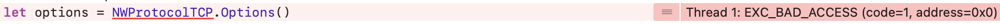
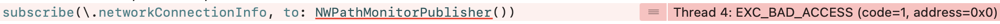
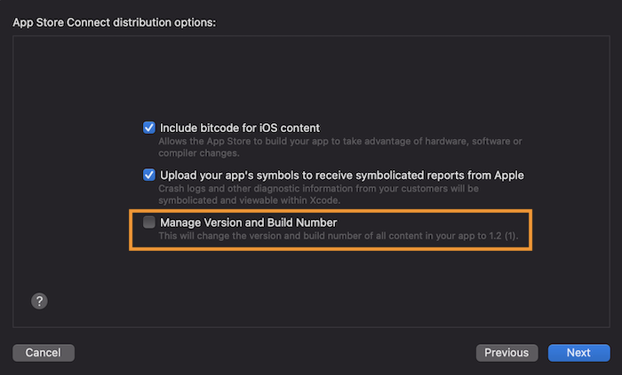

# Known Issues

## Table of Contents
- [Xcode15](#xcode15)
- [Symbol not found: Starscream](#symbol-not-found-starscream)
- [Datadog Dependency Restriction](#datadog-dependency-restriction)
- [App Crash at Launch Using Simulator](#app-crash-at-launch-using-simulator)
- [Cropped TableView in Document Selection for iOS 15](#cropped-tableview-in-document-selection-for-ios-15)
- [SDK Runs Fine on Debug Build, Fails on Release Build](#sdk-runs-fine-on-debug-build-fails-on-release-build)
- [App Crash: Symbol not found for iProov, SocketIO or Starscream](#app-crash-symbol-not-found-for-iproov-socketio-or-starscream)
- [CoreNFC Issues with Xcode 12 and Xcode 12.1](#corenfc-issues-with-xcode-12and-xcode-12.1)
- [Custom Theme Issues](#custom-theme-issues)
  - [Language Localization Issues](#language-localization-issues)
    - [Localizable.strings File](#localizable.strings-file)
    - [Language Changes at Runtime](#language-changes-at-runtime)
- [User Was Not Asked for Face Capturing](#user-was-not-asked-for-face-capturing)
- [Country Missing from the Country List](#country-missing-from-the-country-list)

## Xcode15
There might be crashes when using our frameworks with Xcode15 when using Cocoapods.

Especially when using IProov:


or Datadog:


To fix this issue set the minimum deployment target to 12.0 instead of 11.0 in the post-install hook of your Podfile:
```
config.build_settings['IPHONEOS_DEPLOYMENT_TARGET'] = '12.0'
```

## Symbol not found: Starscream
This issue might occur due to a breaking change in Starscream's latest patch version `4.0.5` when using Cocoapods.  
Especially when updating the Cocoapods repository via `pod install` or similar it leads to an app crash on startup with an error like:
```
Symbol not found: _$s10Starscream17WebSocketDelegateP10didReceive5event6clientyAA0bC5EventO_AA0bC0CtFTq
```

In SDK 4.x, please make sure to force Starscream to version `4.0.4` by adding the following line to your podfile:
```
pod 'Starscream', '4.0.4' 
```

In SDK 3.x, please make sure to additionally force Socket.IO-Client-Swift to version `16.0.1` by adding the following lines to your podfile:
```
pod 'Socket.IO-Client-Swift', '16.0.1' 
pod 'Starscream', '4.0.4'
```

ℹ️&nbsp;&nbsp;__Note:__ This issue is fixed beginning with SDK version `4.6.1`. Also for customers who are still on SDK 3, updating to SDK `3.9.8` will resolve this.

## Datadog dependency Restriction
The Jumio SDK currently supports the data analysis provider Datadog only with the dependency manager Cocoapods or Carthage. If you need to integrate Datadog using another method, reach out to the support team.

## Cropped TableView in Document Selection for iOS 15
For SDK 3.9.4 and below, document type selection appears to be cut off at the top with defaultUI using iOS 15 and above, when compiled with certain Xcode versions.

This bug can be resolved by setting `sectionHeaderTopPadding` attribute of `NetverifyViewController` instance to an appropriate distance for devices using iOS 15, for example:
```
if #available(iOS 15.0, *) {
    UITableView.appearance(whenContainedInInstancesOf: [NetverifyViewController.self]).sectionHeaderTopPadding = 24
}
```

## SDK Runs Fine on Debug Build, Fails on Release Build
For Xcode 13 and above, application might build and run fine for debug builds, but crash on release builds. This might also occur with Testflight. When archiving / exporting an app with Xcode 13, Jumio SDK cannot be initialized and might throws the following exception, despite the fact that SDK version and all framework versions appear to be correct:

```
SDKVersionNotCompatibleException: JumioFRAMEWORK is expected to be of version X.X.X
```

This is due to Xcode 13 introducing a new option to their __App Store Distribution Options__:

__"Manage Version and Build Number"__ (see image below)

If checked, this option changes the version and build number of all content of your app to the overall application version, including third-party frameworks. __This option is enabled by default.__ Please make sure to disable this option when archiving / exporting your application to the App Store. Otherwise, the Jumio SDK version check, which ensures all bundled frameworks are up to date, will fail.



Alternatively, it is also possible to set the key `manageAppVersionAndBuildNumber` in the __exportOptions.plist__ to `false`:
```
<key>manageAppVersionAndBuildNumber</key>
<false/>
```

## App Crash: Symbol not found for iProov, SocketIO or Starscream
After updating to SDK 3.8.0 and above, the app crashes without warning or the following error message is displayed:

_dyld: Symbol not found: _$s8SocketIO0A11ClientEventO10disconnectyA2CmFWC_  
_Referenced from: /Users/.../Frameworks/iProov.framework/iProov  
  Expected in: /Users/b.../Frameworks/SocketIO.framework/SocketIO
 in /Users/.../Frameworks/iProov.framework/iProov_

When using iProov, please make sure the following post install hook is included in your `podfile`:

```
post_install do |installer|
  installer.pods_project.targets.each do |target|
    if ['iProov', 'Socket.IO-Client-Swift', 'Starscream'].include? target.name
      target.build_configurations.each do |config|
          config.build_settings['BUILD_LIBRARY_FOR_DISTRIBUTION'] = 'YES'
      end
    end
   end
end
```

## CoreNFC Issues with Xcode 12 and Xcode 12.1
Building an application including NetverifyFace framework with a simulator target using Xcode12 might result in the following error:

_Building for iOS Simulator, but linking in dylib built for iOS, file '.../mobile-sdk-ios/frameworks/NetverifyFace.framework/NetverifyFace' for architecture arm64_

This seems to be an issues with the linking against `Core NFC`. Apple is aware of this and [will resolve it in Xcode 12.2.](https://developer.apple.com/documentation/xcode-release-notes/xcode-12_2-beta-release-notes#Simulator) The problem seems to occur on iOS 14 simulators only. Any version lower than that should not have any issues.

## Library Not Loaded: Image Not Found
Building an application using Objective C might result in the following error:

_Termination Description: DYLD, Library not loaded: @rpath/libswiftCore.dylib | Referenced from: {PATH} | Reason: image not found_

Please make sure `ALWAYS_EMBED_SWIFT_STANDARD_LIBRARIES` is set to `Yes` in the __Build Options.__

## Custom Theme Issues

### Language Localization Issues
Please make sure to select your project in the project and targets list in the __Project Navigator,__ navigate to the __Info__ tab. In the __Localizations__ section, make sure that _"Use Base Internationalization"_ is checked. Otherwise, the system will fall back on the default localization.

To select a different language use the “+” button in the __Localizations__ section. This will let you choose a new language you want to support from a dropdown list. Please refer to the [full list of languages supported by Jumio](../README.md#language-localization) for more details. Adding a new language from the list will generate files under a new language project folder named `[new language].lproj` For example, if Japanese support is added, a folder named `ja.lproj` will be created.

#### Localizable.strings File
The `Localizable-Jumio.strings` file makes it possible to easily add translations as key-value pairs. Adapt the values to your required language as needed and add it to your app or framework project. Again, please make sure to mark the project as _Localizable._ After SDK updates, make sure to check whether the content of this localization file is up to date, as individual strings may have changed.

ℹ️&nbsp;&nbsp;__Note:__ Refer to the transition guides for possible updates.

#### Language Changes at Runtime
Runtime language changes _within_ the SDK or separate language support (meaning the SDK language differs from the overall device language) is not possible. This goes against Apple's basic iOS user model for switching languages in the Settings app.

## User Was Not Asked for Face Capturing
If there is an issue with the user journey skipping over the face capturing and not asking the user to take a selfie, please make sure the parameter `config.enableIdentityVerification` is set to `true`. If it is set to `false` the 3D-Liveness step won't be performed.

## Country Missing from the Country List
Countries with documents that need barcode functionality (e.g. US and Canadian driver licenses) might not be available if the necessary frameworks are missing in SDK prior to 4.7.0:

`MicroBlink.framework`  
`NetverifyBarcode.framework`

Frameworks and instructions on how to integrate them [can be found here.](../README.md#integration)

ℹ️&nbsp;&nbsp;__Note:__ Version numbers may vary.
