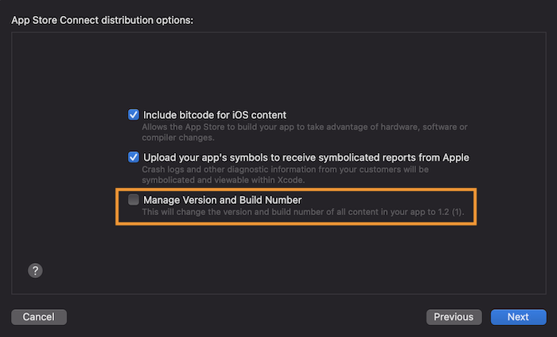

# Known Issues

## Table of Contents
- [Portrait Effect](#portrait-effect)
- [Xcode16](#xcode16)
- [Apple Privacy Guidelines](#apple-privacy-guidelines)
- [4.9.0](#490)
- [SDK Runs Fine on Debug Build, Fails on Release Build](#sdk-runs-fine-on-debug-build-fails-on-release-build)
- [Custom Theme Issues](#custom-theme-issues)
  - [Language Localization Issues](#language-localization-issues)
    - [Localizable.strings File](#localizable.strings-file)
    - [Language Changes at Runtime](#language-changes-at-runtime)
    
## Portrait Effect

The Liveness check will fail, if you add the key `NSCameraPortraitEffectEnabled` to your Info.plist file. Make sure that it is not set.

## Xcode16

There might be crashes on app startup when using our Datadog frameworks with Xcode16 via Cocoapods.
For versions `4.10.0` and `4.11.0` if you use `Jumio` default podspec (`All`) please use the fixed versions `4.10.1` and `4.11.1`.
For versions below `4.10.0` or if you use `Jumio/Datadog` pod we advise to remove the Datadog dependency (`Jumio/Datadog`) or update to the newer versions.

## Apple Privacy Guidelines

The guide of Jumio SDK compliance to Apple Privacy Guidelines is in [integration FAQ](integration_faq.md#apple-privacy-guidelines)

## 4.9.0

There might be crashes on app startup when using our `4.9.0` frameworks on iOS 12.
Please use version `4.9.1` instead.

## SDK Runs Fine on Debug Build, Fails on Release Build

For Xcode 13 and above, application might build and run fine for debug builds, but crash on release builds. This might also occur with Testflight. When archiving / exporting an app with Xcode 13, Jumio SDK cannot be initialized and might throws the following exception, despite the fact that SDK version and all framework versions appear to be correct:

```
SDKVersionNotCompatibleException: JumioFRAMEWORK is expected to be of version X.X.X
```

This is due to Xcode 13 introducing a new option to their **App Store Distribution Options**:

**"Manage Version and Build Number"** (see image below)

If checked, this option changes the version and build number of all content of your app to the overall application version, including third-party frameworks. **This option is enabled by default.** Please make sure to disable this option when archiving / exporting your application to the App Store. Otherwise, the Jumio SDK version check, which ensures all bundled frameworks are up to date, will fail.



Alternatively, it is also possible to set the key `manageAppVersionAndBuildNumber` in the **exportOptions.plist** to `false`:

```
<key>manageAppVersionAndBuildNumber</key>
<false/>
```

## Library Not Loaded: Image Not Found

Building an application using Objective C might result in the following error:

`Termination Description: DYLD, Library not loaded: @rpath/libswiftCore.dylib | Referenced from: {PATH} | Reason: image not found`

Please make sure `ALWAYS_EMBED_SWIFT_STANDARD_LIBRARIES` is set to `Yes` in the **Build Options.**

## Custom Theme Issues

### Language Localization Issues

Please make sure to select your project in the project and targets list in the **Project Navigator,** navigate to the **Info** tab. In the **Localizations** section, make sure that _"Use Base Internationalization"_ is checked. Otherwise, the system will fall back on the default localization.

To select a different language use the “+” button in the **Localizations** section. This will let you choose a new language you want to support from a dropdown list. Please refer to the [full list of languages supported by Jumio](../README.md#language-localization) for more details. Adding a new language from the list will generate files under a new language project folder named `[new language].lproj` For example, if Japanese support is added, a folder named `ja.lproj` will be created.

#### Localizable.strings File

The `Localizable-Jumio.strings` file makes it possible to easily add translations as key-value pairs. Adapt the values to your required language as needed and add it to your app or framework project. Again, please make sure to mark the project as _Localizable._ After SDK updates, make sure to check whether the content of this localization file is up to date, as individual strings may have changed.

⚠️&nbsp;__Tip:__ Refer to the transition guides for possible updates.

#### Language Changes at Runtime

Runtime language changes _within_ the SDK or separate language support (meaning the SDK language differs from the overall device language) is not possible. This goes against Apple's basic iOS user model for switching languages in the Settings app.
